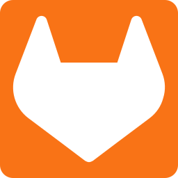
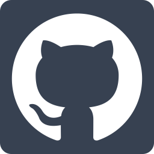

# NURIDOCU

:green_heart: Si te gusta el contenido de este repositorio o te resulta últil, deja una estrellita :star:, es gratis :green_heart:

Este repositorio nace con el fín de almacenar y compartir documentación en español sobre distintos temas como HPC(High Performance Computing), Desarrollo Web, Ciberseguridad, Linux, Windows, servicios, etc.

Si tu intención es seguir un 'roadmap' para aprender con estos apuntes siento decirte que no es lo más indicado por que no siguen un orden, según la necesidad o el problema surge un fichero markdown con esos apuntes.
Pero, espera, eso no quiere decir que no tenga algo preparado, si quieres aprender diversas tecnologías siguiendo una hoja de ruta échale un ojo a [SKILLY](www.skilly.es).

## ¿Pero que voy a encontrar aquí? ¡EL ÍNDICEEEE!

Bueno tranqui, te voy a dejar un índice con el contenido de este repo.

> :woman_facepalming: es posible que el índice no esté actualizado, sorry! :pray:

- [nagios4 NRPE fichero](./nagios4/nrpe/nrpe.md)
- [nagios4 NRPE](./nagios4/nrpe/explicando-fich-nrpe.md)
- [ventoy iniciacion](./utiles/ventoy-iniciacion.md)
- [iniciacion powershell](./windows/powershell/iniciacion-powershell.md)
- [apuntes powershell](./windows/powershell/apuntes-powershell.md)

    

## :warning: INFORMACIÓN SUPER RELEVANTE :warning:

### :pencil2: Erratas o actualizaciones

Si encuentras erratas en los apuntes o crees que los puedes mejorar o añadir información eres libre de editarlo y subirlo a este repo, a mi me ayudarás un montón y al que lo lea también.
Además de que te mencionaré en [Buena peñita colaboradora](#gem-buena-peñita-colaboradora) y eso siempre mola.

### :page_facing_up: Licencia y uso

Mira, esto es un poco aburrido, a mi tampoco me hace gracia pero hay que pasar por ello para proteger la autoría de la [Buena peñita colaboradora](#gem-buena-peñita-colaboradora)

Todo el contenido de este repo esta bajo la licencia [Creative Commons Attribution-NonCommercial 4.0 International Public License](./LICENSE).

Básicamente quiere decir que tienes libertad de guardar y compartir el contenido del repo siempre y cuando hagas referencia a los autores o autor y no lo uses con fines comerciales.

### :gem: Buena peñita colaboradora

    

        
        
        
    

### :phone: Contacto

    

        
        
        
        
        
    

Me llamo Nuria pero tu puedes llamarme al 6.. :wink:
No, no me llames, si eso manda un mail a <hola@nuridocu.es> y me cuentas

> :warning: esta cuenta de correo está habilitada para recibir invitaciones a unas cerves (aun que sea por Discord) :beer:
