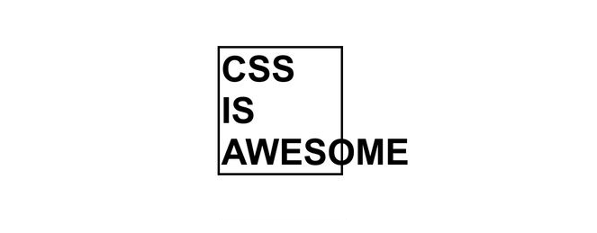
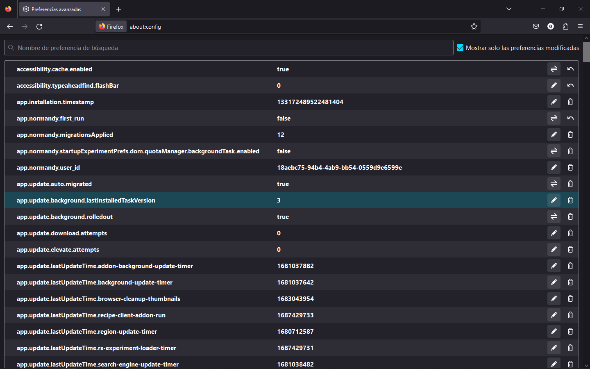

# CSS

Cascading Style Sheets

## ¿Qué es CSS?

CSS (Cascading Style Sheets) es un lenguaje de estilo utilizado para definir la apariencia y presentación de las páginas web. Proporciona un conjunto de reglas y propiedades que permiten a los desarrolladores controlar el diseño, el formato y la disposición de los elementos HTML en una página.

Con CSS, los desarrolladores pueden aplicar estilos como colores, fuentes, márgenes, bordes, espaciado y efectos visuales a los elementos HTML. Esto les brinda el poder de personalizar y mejorar la apariencia de una página web, haciendo que sea atractiva y coherente en todos los dispositivos y navegadores.

CSS se utiliza junto con HTML para separar la estructura y el contenido de una página web de su estilo y presentación. Esto facilita la modificación y mantenimiento de un sitio web, ya que los estilos pueden aplicarse de manera centralizada a través de hojas de estilo CSS, lo que permite cambios rápidos y consistentes en toda la página o el sitio.

>:warning: **ADVERTENCIA** ten en cuenta que generalmente tenemos varios documentos HTML en un sitio web pero sólo tenemos un documento CSS asi que todos los cambios que hagamos se verán reflejados en todos los documentos HTML donde esté enlazado

## Enlazar CSS

En principio hay tres formas de hacerlo, las vamos a ver desde la más común a la menos habitual.

|                     | Etiqueta/atributo                        | Descripción                                                                                 |
|---------------------|------------------------------------------|---------------------------------------------------------------------------------------------|
| Archivo CSS Externo | `<link rel="stylesheet" src="main.css">` | El código de escribe en un fichero CSS a parte del HTML. :white_check_mark: **RECOMENDADO** |
| Bloque de estilos | `` | El código se escribe dentro de la etiqueta `<style>` dentro del `<head>`
| Estilo en línea | Atributo HTML `style=""` | El código se escribe en el atributo `style=""` de cualquier etiqueta de HTML :no_entry: **PROHIBIDO** |

>:pencil: **NOTA** cuando se usa la etiqueta `<link rel="stylesheet">` para referenciar a un archivo externo de CSS es recomendable escribir esta línea lo primero dentro de la etiqueta `<head>`. Así se obliga al navegador a aplicar los estilos lo antes posible y evitar la *falsa percepción visual*
>
>:woman_teacher: **EXPLICACIÓN** la **falsa percepción visual** se refiere a los casos en que la página se vé en blanco hasta que cargan los estilos.
>
>:books: **PARA SABER MÁS** antiguamente se utilizaba el atributo `type="text/css"`, a partir de HTML5 ya no es necesario pero a veces se mantiene para **asegurar la retrocompatibilidad** con navegadores antiguos.
>
> :gift_heart: **CONSEJO** si quieres hacer pruebas rápidas con HTML, CSS y Javascript puedes utilizar plataformas que permiten previsualizar en tiempo real. [CodePen](https://codepen.io/pen) o [CodeSandbox](https://codesandbox.io/)

## Estructura y sintaxis

### Sintaxis de una regla

#### Advertencias y notas

>:warning: **ADVENTENCIA** solo se puede establecer una regla por línea.
>
>:warning: **ADVERTENCIA** usa la identación tras el primer `{`. Esto hará que el código sea más legible y estarás utilizando buenas prácticas
>
>:pencil: **NOTA** el último `;` dentro de una regla es opcional pero es aconsejable escribilo

### Comentarios

### Conjunto de reglas

## Navegadores

Los navegadores web o clientes, son un punto importante a tener en cuenta a la hora de maquetar una página o aplicacion web. Lo idílico, sería que todas las web se verían correctamente y de la misma forma en todos los navegadores, sin embargo, no es tan sencillo como se puede pensar a simple vista.
Cada navegador tiene características propias, otras que no se incluyen por razones internas de la empresa, alguno navegadores implementan características antes que el resto, etc. En un principio, el consorcio [W3C](https://w3.org/) es el encargado de definir las especificaciones y "normas" recomendadas para todos los navegadores pero luego cada compañía es libre de implementar sus características.

Entonces, **¿cómo se que características tiene cada navegador?**
Como siempre, hay algunas empresas más comprometidas que ofrecen a los desarrolladores, diseñadores, entusiastas... una hoja de ruta cronológica donde mencionan las características que van implementando, descartando o futuras implementaciones.

|Compañía|Navegador|Hoja de ruta|
|--------|---------|------------|
|Microsoft| Microsoft Edge | [Edge Platform Status](https://developer.microsoft.com/en-us/microsoft-edge/status/)
|Fundación Mozilla|Mozilla Firefox| [Mozilla Standards Position](https://mozilla.github.io/standards-positions/)
|Google | Google Chrome | [Chrome Platform Status](https://www.chromestatus.com/features)

>:pencil: **NOTA**: también se pueden ver los últimos cambios en [Browser Platform Status Tracker](https://platformstatus.io/). Esta página recopila información de cada una de las hojas de ruta de los navegadores y la publica para centralizar la información.

Otro dato al que tenemos que tener muy en cuenta es **que versión de cada navegador usa la mayoría de nuestro público**, ya que de una versión a otra hay características o funcionalidades que no se van a poder disfrutar.

Desde la web de [CanIUse](https://caniuse.com/css-container-query-units) se pueden **ver que características están ya implementadas o se preveen implementar**.

>:pencil: **NOTA**: actualmente los navegadores implementan `evergreen browser`. Esta estrategia es utilizda para que todos los navegadores, conectados a internet, estén actualizados a la última versión sin obligar al usuario a actualizar manualmente.

### Navegadores actuales

En esta gráfica se pueden apreciar el uso histórico que han tenido la mayoría de navegadores conocidos. Llama la atención la rápida subida de Google Chrome y la fuerte bajada de Internet Explorer (ya descontinuado)

> :pencil: **NOTA**: esta gráfica ha sido generada en [StatCounter](https://gs.statcounter.com/browser-market-share/desktop/worldwide/#monthly-200901-202305).
> :pencil: **NOTA**: también puedes ver un gráfico sobre que versión de cada navegador es la más utilizada en esta web [Can I Use](https://caniuse.com/usage-table)
>
>:books: **PARA SABER MÁS** existen navegadores para terminales de texto, son útiles en determinados ámbitos o tareas. Algunos de los navegadores de texto son [Links](http://links.twibright.com/), [Lynx](http://lynx.invisible-island.net/), [w3m](http://w3m.sourceforge.net/)

## Niveles de CSS

CSS no tiene una versión "CSS3" en el sentido de una nueva edición completa, sino que se ha dividido en módulos individuales que evolucionan de forma independiente. Cada módulo tiene su propio nivel de desarrollo y adopción en los navegadores.

>:books: **PARA SABER MÁS** puedes consultar la página web del consorcio W3C para obtener más información técnica sobre la evolución de los diferentes módulos de CSS. [CSS history](https://www.w3.org/Style/CSS20/history.html)

|Nivel|Año|Descripción|
|-|-|-|
|CSS1|1996|Fue la primera versión oficial de CSS. Este nivel permitía aplicar estilos básicos como tipografía, colores, alineación y algunos aspectos de diseño.|
|CSS2|1998|Expandió las capacidades de CSS1 al agregar propiedades de posicionamiento, tipos de medios (como impresión y proyección), mejoras en el manejo de tablas, entre otros.|
|CSS2.1|2005|Fue una revisión de CSS2 que corrigió errores y aclaró ciertas propiedades. Su objetivo principal fue mejorar la estabilidad y la compatibilidad entre navegadores.|
|CSS3|2011|Comenzó a adoptar un enfoque modular, donde diferentes características se desarrollan como módulos independientes en lugar de lanzar una versión completa de CSS3. Cada módulo representa una característica específica de CSS, como Flexbox (para diseño flexible), Grid (para diseño en cuadrícula) o características de Texto. Estos módulos se han ido implementando gradualmente en los navegadores a medida que se completan y se estandarizan.|

### W3C y los grupos de trabajo

CSS es una especificación desarrollada y mantenida por [W3C](https://w3.org/). Se encargan de desarrollar los estándares para asegurar la neutralidad de la web y el crecimiento sano, dejando de lado los intereses de las empresas privadas que administran cada navegador.
En este consorcio participan casi todas las empresas relacionadas con el mundo web como Apple, Google, Facebook, Twitter, Nokia, etc.

>:books: **PARA SABER MÁS**: puedes echarle un vistazo a [todos los miembros del consorcio W3C](http://www.w3.org/Consortium/Member/List) desde su página web

También existen grupos de trabajo enfocados en temáticas particulares, tienen la responsabilidad de liderar la evolución y el desarrollo de los estándares y tecnologías web, asegurando la interoperabilidad, la accesibilidad y la innovación en la plataforma web global. Su trabajo es fundamental para mantener la web abierta, inclusiva y capaz de satisfacer las necesidades cambiantes de los usuarios y las industrias.

Aquí menciono alguno de ellos.

| Grupo | Nombre del grupo | Actividad |
|-------|------------------|-----------------------|
|WHATWG| Web Hypertext Application Technology Working Group | Desarrollo y mantenimiento de estándares abiertos para la web.|
|CSSWG|CSS Working Group|Desarrollo y mantenimiento de estándares relacionados con CSS.|
|AGWG|Accessibility Guidelines Working Group|Promoción de la accesibilidad en la web mediante pautas y estándares.|
|WOTWG|Web of Things Working Group|Desarrollo de estándares para la conexión y control de dispositivos físicos a través de la web.|
|BTTWG|Browser Testing and Tools Working Group| Producir tecnologías para su uso en pruebas, depuración y resolución de problemas de aplicaciones web que se ejecutan en navegadores web.|

>:books: **PARA SABER MAS**: puedes comprobar todos los grupos de trabajo en la web de W3C. [Listado de los grupos de trabajo](https://www.w3.org/groups/wg/ag/)

### Prefijos CSS de navegador

>:warning: **ADVERTENCIA** Actualmente los prefijos están considerados como obsoletos y se recomienda utilizar [flags de navegador](#flags-de-navegador)

Los prefijos de navegador en CSS son una técnica utilizada para hacer referencia a características experimentales o propiedades en desarrollo que aún no están completamente definidas en las especificaciones oficiales de CSS. Estos prefijos permiten a los desarrolladores utilizar estas características en navegadores específicos mientras evitan conflictos con implementaciones futuras o diferentes interpretaciones de los navegadores.

Los prefijos de navegador se agregan como un prefijo al inicio de una propiedad CSS para indicar qué navegador específico está implementando esa característica en particular.

~~~css
-webkit-: Utilizado en navegadores basados en el motor WebKit, como Chrome y Safari.
-moz-: Utilizado en el antiguo motor Gecko de Firefox.
-ms-: Utilizado en Internet Explorer y navegadores basados en el motor Trident.
-o-: Utilizado en versiones antiguas de Opera, cuando utilizaba el motor Presto.
~~~

Estos prefijos permiten a los desarrolladores utilizar características CSS experimentales o propiedades en desarrollo antes de que sean oficialmente admitidas en todos los navegadores. Sin embargo, es importante tener en cuenta que el uso de prefijos de navegador puede resultar complicado y engorroso, ya que requiere agregar múltiples versiones de una propiedad para admitir diferentes navegadores.

### Flags de navegador

Las "flags" de navegador son opciones experimentales que se pueden habilitar o deshabilitar en la configuración del navegador. Estas opciones permiten a los usuarios probar características o funcionalidades que aún están en desarrollo y no están disponibles de forma predeterminada en las versiones estables del navegador.

Para acceder a las flags en diferentes navegadores, se utilizan direcciones específicas. Por ejemplo:

En **Firefox**: Debes ingresar "about:config" en la barra de direcciones del navegador. Al acceder a esta página, verás una lista de opciones de configuración avanzadas, incluyendo opciones experimentales. Puedes habilitar o deshabilitar estas opciones según tus necesidades.

En **Chrome**: Debes ingresar "chrome://flags" en la barra de direcciones del navegador. Al acceder a esta página, encontrarás una lista de flags disponibles que puedes activar o desactivar. Estas flags pueden variar según la versión de Chrome que estés utilizando.

>:warning: **ADVERTENCIA** las flags son características experimentales y pueden tener comportamientos inestables o no estar completamente desarrolladas. Están destinadas a desarrolladores y usuarios avanzados que deseen probar nuevas funcionalidades antes de su lanzamiento oficial.
>:warning: **ADVERTENCIA** es posible que cambien o se eliminen en futuras actualizaciones del navegador, por lo que es recomendable utilizarlas con precaución y solo cuando sea necesario para casos específicos de desarrollo o pruebas.
