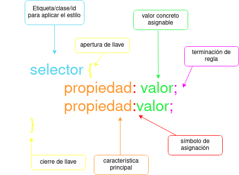
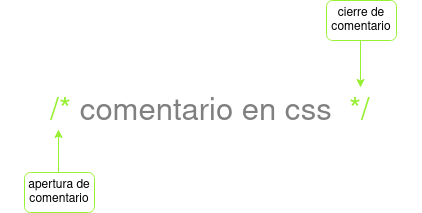
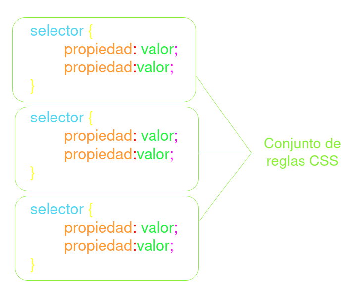

# CSS

Cascading Style Sheets

## ¿Qué es CSS?

CSS (Cascading Style Sheets) es un lenguaje de estilo utilizado para definir la apariencia y presentación de las páginas web. Proporciona un conjunto de reglas y propiedades que permiten a los desarrolladores controlar el diseño, el formato y la disposición de los elementos HTML en una página.

Con CSS, los desarrolladores pueden aplicar estilos como colores, fuentes, márgenes, bordes, espaciado y efectos visuales a los elementos HTML. Esto les brinda el poder de personalizar y mejorar la apariencia de una página web, haciendo que sea atractiva y coherente en todos los dispositivos y navegadores.

CSS se utiliza junto con HTML para separar la estructura y el contenido de una página web de su estilo y presentación. Esto facilita la modificación y mantenimiento de un sitio web, ya que los estilos pueden aplicarse de manera centralizada a través de hojas de estilo CSS, lo que permite cambios rápidos y consistentes en toda la página o el sitio.

>:warning: **ADVERTENCIA** ten en cuenta que generalmente tenemos varios documentos HTML en un sitio web pero sólo tenemos un documento CSS asi que todos los cambios que hagamos se verán reflejados en todos los documentos HTML donde esté enlazado

## Enlazar CSS

En principio hay tres formas de hacerlo, las vamos a ver desde la más común a la menos habitual.

|  | Etiqueta/atributo | Descripción |
|----|-------------------|-------------|
| Archivo CSS Externo | `<link rel="stylesheet" src="main.css">` | El código de escribe en un fichero CSS a parte del HTML. :white_check_mark: **RECOMENDADO** |
| Bloque de estilos | `` | El código se escribe dentro de la etiqueta `<style>` dentro del `<head>`
| Estilo en línea | Atributo HTML `style=""` | El código se escribe en el atributo `style=""` de cualquier etiqueta de HTML :no_entry: **PROHIBIDO** |

>:pencil: **NOTA** cuando se usa la etiqueta `<link rel="stylesheet">` para referenciar a un archivo externo de CSS es recomendable escribir esta línea lo primero dentro de la etiqueta `<head>`. Así se obliga al navegador a aplicar los estilos lo antes posible y evitar la *falsa percepción visual*

>:woman_teacher: **EXPLICACIÓN** la **falsa percepción visual** se refiere a los casos en que la página se vé en blanco hasta que cargan los estilos.

>:books: **PARA SABER MÁS** antiguamente se utilizaba el atributo `type="text/css"`, a partir de HTML5 ya no es necesario pero a veces se mantiene para **asegurar la retrocompatibilidad** con navegadores antiguos.

> :gift_heart: **CONSEJO** si quieres hacer pruebas rápidas con HTML, CSS y Javascript puedes utilizar plataformas que permiten previsualizar en tiempo real. [CodePen](https://codepen.io/pen) o [CodeSandbox](https://codesandbox.io/)

## Estructura y sintaxis

### Sintaxis de una regla

#### Advertencias y notas

>:warning: **ADVENTENCIA** solo se puede establecer una regla por línea.
>
>:warning: **ADVERTENCIA** usa la identación tras el primer `{`. Esto hará que el código sea más legible y estarás utilizando buenas prácticas
>
>:pencil: **NOTA** el último `;` dentro de una regla es opcional pero es aconsejable escribilo

### Comentarios

### Conjunto de reglas

## Navegadores

### Prefijos CSS de navegador

### Flags de navegador

## Niveles de CSS
