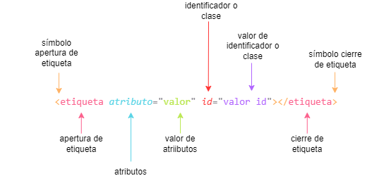
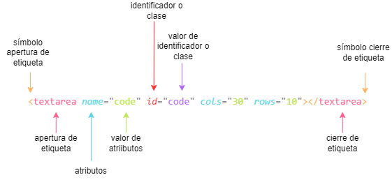
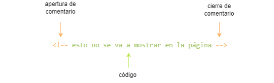
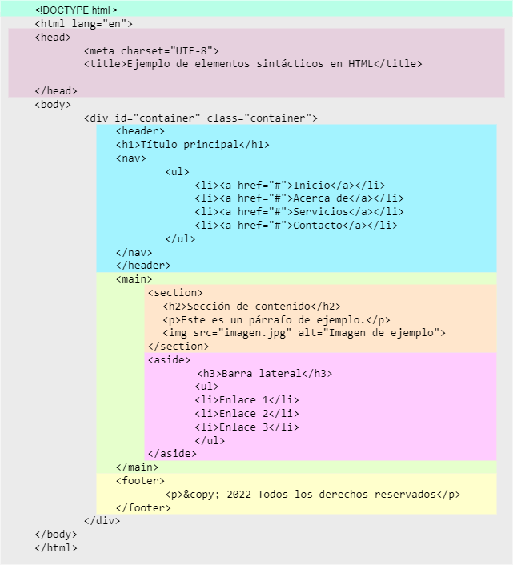

# HTML

HyperText Markup Language (Lenguaje de Marcado de Hipertexto)

## ¿Qué es HTML?

HTML es el lenguaje de marcado utilizado para crear la estructura y el contenido de las páginas web. Es el cimiento sobre el cual se construyen las experiencias en línea, permitiendo a los desarrolladores definir la semántica y presentación de la información en la web.

## Esquema básico

~~~html
<!DOCTYPE html>
<html>
<head>
  <title>Título de la página</title>
</head>
<body>
  Contenido de la página
</body>
</html>obs
~~~

**!DOCTYPE html**: Declaración del tipo de documento HTML.
**html**: Elemento raíz que envuelve todo el contenido de la página.
**head**: Contiene metadatos y enlaces a recursos externos.
**title**: Define el título de la página que se muestra en la pestaña del navegador.
**body**: Contiene el contenido visible de la página.

### DOCTYPE html

Esta declaración se coloca al comienzo de un documento HTML y le indica al navegador que se está utilizando la última versión de HTML, que en este caso es HTML5. Sirve para garantizar la correcta interpretación del código HTML por parte del navegador.

### HTML

Se utiliza para indicar el inicio y fin del documento HTML. Todo el contenido de la página web debe estar contenido dentro de esta etiqueta.

### HEAD

Se utiliza para incluir metadatos y enlaces a recursos externos que son necesarios para la página web, pero no se muestran directamente en la ventana del navegador.

- `<title>`: Define el título de la página web, que se muestra en la barra de título del navegador.
- `<meta charset="UTF-8">`: Especifica la codificación de caracteres utilizada en la página. UTF-8 es la codificación más común y compatible con la mayoría de los caracteres y símbolos.
- `<meta name="description" content="Descripción de la página">`: Proporciona una breve descripción de la página para los motores de búsqueda y otros servicios.
- `<meta name="keywords" content="palabra clave1, palabra clave2, ...">`: Define las palabras clave o frases relacionadas con el contenido de la página, ayudando a los motores de búsqueda a indexarla correctamente.
- `<meta name="author" content="Nombre del autor">`: Especifica el nombre del autor de la página.
- `<link rel="stylesheet" href="ruta/al/archivo.css">`: Enlaza un archivo de hoja de estilos CSS externo para aplicar estilos a la página.
- `<script src="ruta/al/archivo.js"></script>`: Enlaza un archivo de script JavaScript externo para agregar funcionalidad a la página.
- `<base href="URL base">`: Especifica una URL base que se utiliza como referencia para las URLs relativas en la página.
- `<style>...</style>`: Permite incluir estilos CSS directamente en el documento HTML.
- `<script>...</script>`: Permite incluir scripts JavaScript directamente en el documento HTML.
- `<noscript>...</noscript>`: Define el contenido que se mostrará si el navegador no admite scripts o si están desactivados.

### BODY

Contiene todo el contenido visible de la página web. Aquí se colocan los elementos como texto, imágenes, enlaces, formularios, etc., que se mostrarán en la ventana del navegador.

## ¿Qué son las etiquetas?

Es una parte estructural o de contenido de una página web. Se define mediante etiquetas HTML y puede contener texto, imágenes, enlaces y otros elementos. Por ejemplo, la etiqueta "p" se utiliza para definir un párrafo, "img" para mostrar una imagen, y "a" para crear un enlace.

SINTAXIS



EJEMPLO



### Atributos

Los atributos proporcionan información adicional sobre un elemento y se especifican dentro de la etiqueta de apertura. Por ejemplo, el atributo src se utiliza en la etiqueta "img" para especificar la URL de la imagen que se mostrará.

Existen 3 tipos de atributos:

- **Conjunto de valores**: sólo se permiten unos valores concretos
- **Valores libres**: se puede especificar el valor que quieras
- **Valores booleanos**: solo pueden tener valor **true** o **false**. Si no tienen **ningún valor**, por defecto, se establece a **true** y si **no** tiene **definido** el atributo se establece a **false**

#### Atributos de CSS

##### ID

Los IDs son atributos que se utilizan para identificar de forma única un elemento en una página web, son útiles para seleccionar elementos específicos con CSS o JavaScript.. Se definen mediante el atributo id y deben ser únicos en toda la página.

>:pencil: **NOTA** en mi opinión es mejor utilizar sólo clases, salvo que se necesite expresamente un ID.

##### Clases

Las clases son atributos que se utilizan para agrupar elementos relacionados y aplicar estilos o comportamientos comunes a través de CSS o JavaScript. Se definen mediante el atributo class y se pueden aplicar a múltiples elementos en una página.
La idea de las clases es establecer géneros o tipos de etiquetas, a los que les asociemos características comunes.

>:pencil: **NOTA** para indicar varias clases se deben separar por espacios dentro del mismo atributo class. Ejemplo: ```class="articulo lateral"```

##### Style

Se utiliza para aplicar estilos específicos a un elemento. Permite definir reglas de estilo directamente en el elemento, en lugar de utilizar una hoja de estilos externa o interna. El atributo style acepta valores en forma de pares clave-valor, donde la clave representa la propiedad de estilo y el valor corresponde al valor que se le desea asignar.

>:warning: **ADVERTENCIA** no se recomienda añadir los estilos de esta forma, suele ser considerado una malísima práctica

#### Atributos de idioma

##### Lang

Se utiliza para indicar el idioma del contenido dentro de una etiqueta HTML. Se coloca en la etiqueta "<html>" y su valor debe ser el código ISO 639-1 del idioma correspondiente. Esto permite establecer el idioma en el que se encuentra el documento, lo cual es especialmente útil para la accesibilidad y la correcta interpretación del contenido por parte de los navegadores y herramientas de traducción.

~~~html
<!DOCTYPE html>
<html lang="es">
  ...
</html>
~~~

##### Translate

Se utiliza para indicar si una etiqueta debe ser traducida o no. Por defecto, todas las etiquetas se consideran traducibles, a menos que se especifique lo contrario. El atributo translate acepta los valores "yes" (sí) y "no" (no). Si se desea que un texto específico no sea traducido, se puede agregar el atributo translate="no" a la etiqueta correspondiente. Esto es útil, por ejemplo, para mantener títulos o frases específicas sin cambios en diferentes idiomas.

~~~html
<p translate="no">This paragraph should not be translated.</p>
~~~

##### Dir

Se utiliza para indicar la direccionalidad del texto en un documento. Por defecto, la dirección es de izquierda a derecha (ltr), pero se puede modificar estableciendo el valor "rtl" para indicar una dirección de derecha a izquierda. Esto es útil para idiomas que se escriben o leen en direcciones opuestas, como el árabe o el hebreo.

~~~html
<p dir="rtl">هذا هو مثال للنص باتجاه من اليمين إلى اليسار.</p>
~~~

>:pencil: **NOTA** también se puede lograr el mismo efecto utilizando la propiedad CSS direction con los valores "ltr" o "rtl".

#### Propiedades

Las propiedades en HTML son atributos especiales que se utilizan para modificar el comportamiento o la apariencia de los elementos. Algunas propiedades comunes incluyen disabled para desactivar un elemento, required para indicar que un campo de formulario es obligatorio, hidden para ocultar un elemento y href para especificar el destino de un enlace.

### Comentarios

Son una práctica muy común en los desarrolladores. Se basa en introducir código junto a unos carácteres que permiten que el navegador ignore lo que introducimos entre ellos.



## Elementos semánticos

HTML5 introdujo una serie de elementos semánticos que proporcionan un significado más claro y estructurado al contenido. Estos elementos ayudan a los motores de búsqueda, navegadores y desarrolladores a comprender la información de manera más precisa y a mejorar la accesibilidad del sitio.

1. `<header>`: Define el encabezado o sección introductoria de un documento o sección.
2. `<nav>`: Define una sección de navegación que contiene enlaces de navegación.
3. `<main>`: Define el contenido principal de una página, excluyendo encabezados, pies de página, barras laterales, etc.
4. `<article>`: Define una sección de contenido independiente, como un artículo, una publicación de blog o un widget.
5. `<section>`: Define una sección lógica o temática de contenido.
6. `<aside>`: Define una sección que contiene contenido relacionado pero que es independiente del contenido principal.
7. `<footer>`: Define el pie de página de un documento o sección.
8. `<figure>`: Define contenido multimedia, como imágenes, gráficos o ilustraciones, junto con una descripción opcional.
9. `<figcaption>`: Define la descripción o leyenda de una figura en `<figure>`.
10. `<time>`: Representa una fecha, hora o intervalo de tiempo.
11. `<blockquote>`: Indica una cita textual más larga que se extrae de otra fuente.
12. `<cite>`: Define el título de una obra citada, como un libro o un artículo.
13. `<q>`: Indica una cita textual más corta que forma parte del texto normal.
14. `<mark>`: Resalta o marca un texto relevante o destacado.

## Estructura de una página web


