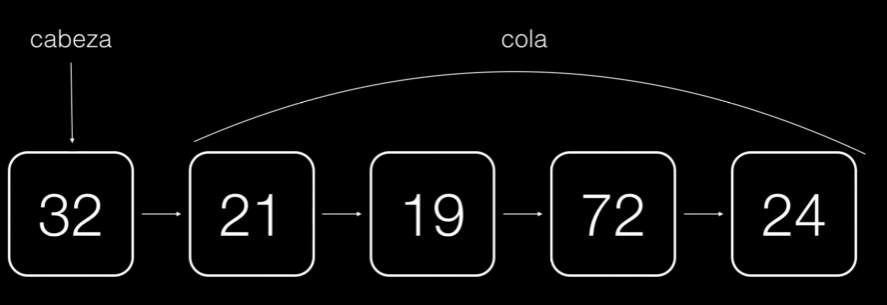
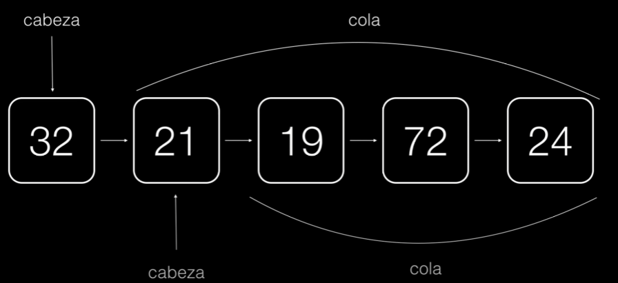

# Listas enlazadas

## ¿Qué son las listas enlazadas?

### Conceptos básicos

Las listas enlazadas son estructuras de datos que permiten almacenar y manipular colecciones de elementos de manera dinámica. A diferencia de los arrays estáticos, las listas enlazadas no requieren un tamaño fijo y pueden crecer o reducirse durante la ejecución del programa.

Una lista enlazada está compuesta por nodos, donde cada nodo contiene un valor y una referencia al siguiente nodo en la lista. El primer nodo de la lista se conoce como "cabeza" o "nodo inicial", y el último nodo no tiene una referencia al siguiente nodo, lo que indica el final de la lista.

El enlace entre los nodos se establece mediante las referencias. Cada nodo tiene una referencia que apunta al siguiente nodo en la lista, lo que permite recorrer los elementos de la lista de manera secuencial.

### Tipos de listas enlazadas

Existen diferentes tipos de listas enlazadas, cada una con sus propias características y usos:

- **Lista enlazada simple**: Cada nodo contiene un valor y una referencia al siguiente nodo. La navegación en esta lista se realiza de forma unidireccional, es decir, solo se puede avanzar en una dirección (de principio a fin).
- **Lista enlazada doble**: Cada nodo contiene un valor, una referencia al nodo siguiente y una referencia al nodo anterior. Esto permite la navegación en ambas direcciones (de principio a fin y de fin a principio).
- **Lista enlazada circular**: El último nodo de la lista tiene una referencia que apunta al primer nodo, formando un ciclo. Esto significa que la lista no tiene un principio ni un final distintos, y se puede recorrer continuamente.

### Ventajas y desventajas

Ventajas

- Flexibilidad en la asignación de memoria
- Inserción y eliminación eficientes
- Uso eficiente del espacio

Desventajas

- Acceso secuencial
- Uso de memoria adicional
- Complejidad en la implementación

## Estructura de una lista enlazada

### Nodo inicial (cabeza), cola y nodo final

Una lista enlazada comienza con un nodo inicial llamado cabeza. La cabeza contiene el primer elemento de la lista y tiene una referencia al siguiente nodo. La lista puede tener un nodo final que apunta a null, indicando el final de la lista.

#### Nodo inicial (cabeza)

#### Cola

#### Nodo final

### Enlace entre nodos

Cada nodo en la lista contiene un valor y una referencia (enlace) al siguiente nodo en la lista. Estos enlaces permiten recorrer la lista de forma secuencial, accediendo a los elementos uno por uno.

#### El uso de `<E>` en Node

En la clase Node`<E>`, el parámetro de tipo `<E>` se utiliza para indicar que la clase Node es una clase genérica y que puede trabajar con cualquier tipo de objeto. La E es una convención comúnmente utilizada para representar el tipo de elemento genérico en las estructuras de datos.

Al utilizar `<E>` como parámetro de tipo, la clase Node se vuelve reutilizable y flexible, ya que puede adaptarse a diferentes tipos de datos según sea necesario. Por ejemplo, si deseas crear una lista enlazada de enteros, puedes utilizar Node`<Integer>` y todos los nodos de la lista contendrán elementos de tipo Integer. Si deseas crear una lista enlazada de cadenas, puedes utilizar Node`<String>` y los nodos contendrán elementos de tipo String.

El uso de genéricos en Java permite crear estructuras de datos más genéricas y versátiles, ya que no están limitadas a un solo tipo de dato. Esto promueve la reutilización de código y la creación de estructuras de datos más flexibles y adaptables a diferentes escenarios de uso.

## ¿Cómo implementar una lista enlazada?

### Clase NODO

- Campos de la clase (`valor`, `siguiente`)
- Métodos (`getValor()`, `setValor()`, `getSiguiente()`, `setSiguiente()`)

La clase Nodo representa un elemento individual en la lista enlazada. Contiene dos campos principales:

- **valor**: almacena el valor o dato que queremos almacenar en el nodo.
- **siguiente**: es una referencia al siguiente nodo en la lista.

Además de los campos, la clase Nodo también proporciona métodos para acceder y modificar estos campos:

- **getValor()**: devuelve el valor almacenado en el nodo.
- **setValor()**: establece un nuevo valor para el nodo.
- **getSiguiente()**: devuelve la referencia al siguiente nodo.
- **setSiguiente()**: establece la referencia al siguiente nodo.

### Clase ListaEnlazada

- Campos de la clase (`cabeza`)
- Métodos (`estaVacia()`, `agregar()`, `mostrar()`, `insertarAlFinal()`, `insertarAlInicio()`, etc.)

La clase ListaEnlazada es la representación de la lista enlazada en su conjunto. Contiene un campo principal:

- **cabeza**: es una referencia al primer nodo de la lista.

Además, la clase ListaEnlazada implementa varios métodos que permiten realizar operaciones en la lista enlazada, como:

- **estaVacia()**: verifica si la lista está vacía.
- **agregar()**: agrega un nuevo nodo a la lista.
- **mostrar()**: muestra todos los valores de los nodos en la lista.
- **insertarAlFinal()**: inserta un nuevo nodo al final de la lista.
- **insertarAlInicio()**: inserta un nuevo nodo al inicio de la lista.
Otros métodos según sea necesario, como eliminar un nodo, buscar un valor específico, etc.

## Operaciones con listas enlazadas

### Agregar elementos a la lista

- Al principio
  
  ~~~java
  Nodo<E> nuevoNodo = new Nodo<>(elemento);
  nuevoNodo.setSiguiente(cabeza);
  cabeza = nuevoNodo;
  ~~~

- Al final

  ~~~java
    Nodo<E> nuevoNodo = new Nodo<>(elemento);
    if (cabeza == null) {
            cabeza = nuevoNodo;
        } else {
            Nodo<E> puntero = cabeza;
            while (puntero.getSiguiente() != null) {
                puntero = puntero.getSiguiente();
            }
            puntero.setSiguiente(nuevoNodo);
        }
  ~~~

- En una posición específica

  ~~~java
  if (posicion < 0) {
            throw new IllegalArgumentException("La posición debe ser mayor o igual a 0");
        }
        if (posicion == 0) {
            agregarAlPrincipio(elemento);
        } else {
            Nodo<E> nuevoNodo = new Nodo<>(elemento);
            Nodo<E> puntero = cabeza;
            int contador = 0;
            while (contador < posicion - 1 && puntero != null) {
                puntero = puntero.getSiguiente();
                contador++;
            }
            if (puntero == null) {
                throw new IndexOutOfBoundsException("La posición está fuera de rango");
            }
            nuevoNodo.setSiguiente(puntero.getSiguiente());
            puntero.setSiguiente(nuevoNodo);
        }
  ~~~

### Mostrar los elementos de la lista

~~~java
    Nodo<E> puntero = cabeza;
        while (puntero != null) {
            System.out.println(puntero.getValor());
            puntero = puntero.getSiguiente();
        }
~~~

### Obtener un elemento de la lista por posición

~~~java
if (posicion < 0) {
            throw new IllegalArgumentException("La posición debe ser mayor o igual a 0");
        }
        Nodo<E> puntero = cabeza;
        int contador = 0;
        while (contador < posicion && puntero != null) {
            puntero = puntero.getSiguiente();
            contador++;
        }
        if (puntero == null) {
            throw new IndexOutOfBoundsException("La posición está fuera de rango");
        }
        return puntero.getValor();
~~~

### Contar la cantidad de elementos en la lista

~~~java
int contador = 0;
        Nodo<E> puntero = cabeza;
        while (puntero != null) {
            contador++;
            puntero = puntero.getSiguiente();
        }
        return contador;  
~~~

### Verificar si la lista está vacía

~~~java
  return cabeza == null;
~~~

### Eliminar elementos de la lista

- Al principio

  ~~~java
  if (cabeza != null) {
            Nodo<E> primerNodo = cabeza;
            cabeza = cabeza.getSiguiente();
            primerNodo.setSiguiente(null);
        }  
  ~~~

- Al final

  ~~~java
  if (cabeza != null) {
            if (cabeza.getSiguiente() == null) {
                cabeza = null;
            } else {
                Nodo<E> puntero = cabeza;
                while (puntero.getSiguiente().getSiguiente() != null) {
                    puntero = puntero.getSiguiente();
                }
                Nodo<E> ultimoNodo = puntero.getSiguiente();
                puntero.setSiguiente(null);
                ultimoNodo = null;
            }
        } 
  ~~~

- Por posición

  ~~~java
  if (posicion < 0) {
            throw new IllegalArgumentException("La posición debe ser mayor o igual a 0");
        }
        if (posicion == 0) {
            eliminarAlPrincipio();
        } else {
            Nodo<E> puntero = cabeza;
            int contador = 0;
            while (contador < posicion - 1 && puntero != null) {
                puntero = puntero.getSiguiente();
                contador++;
            }
            if (puntero == null || puntero.getSiguiente() == null) {
                throw new IndexOutOfBoundsException("La posición está fuera de rango");
            }
            Nodo<E> nodoAEliminar = puntero.getSiguiente();
            puntero.setSiguiente(nodoAEliminar.getSiguiente());
            nodoAEliminar.setSiguiente(null);
        }
  ~~~

### Casos especiales

#### Liberación de memoria y el recolector de basura en Java

En Java, la liberación de memoria se realiza automáticamente mediante el recolector de basura. El recolector de basura identifica y elimina los objetos que ya no son accesibles. Se encarga de administrar la memoria, liberando los objetos que no tienen referencias. El proceso de liberación de memoria es automático y se ejecuta en segundo plano. No es necesario liberar la memoria manualmente en Java. El recolector de basura también llama al método finalize() antes de liberar un objeto, permitiendo realizar tareas de limpieza. El ciclo de recolección de basura se repite periódicamente para garantizar una gestión eficiente de la memoria.

## Diferencias entre arrays, arrayslist y listas enlazadas

| Característica        | Arrays      | ArrayList | Listas Enlazadas |
|-----------------------|-------------|-----------|------------------|
| Tipo de estructura    | Estática    | Dinámica  | Dinámica         |
| Tamaño                | Fijo        | Dinámico  | Dinámico         |
| Almacenamiento        | Contiguo    | Contiguo  | No contiguo      |
| Acceso a elementos    | Índices     | Índices   | Secuencial       |
| Inserción/eliminación | Ineficiente | Eficiente | Eficiente        |
| Uso de memoria        | Menor       | Mayor     | Mayor            |
| Flexibilidad          | Limitada    | Alta      | Alta             |
