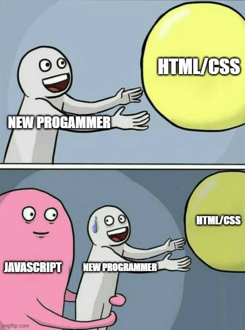
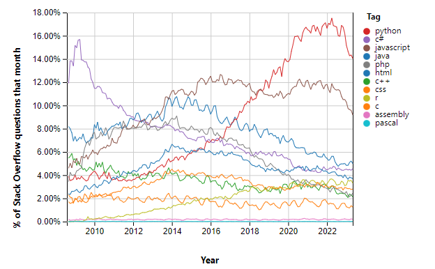
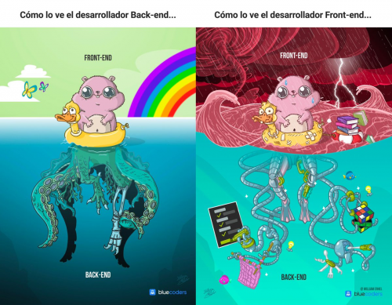
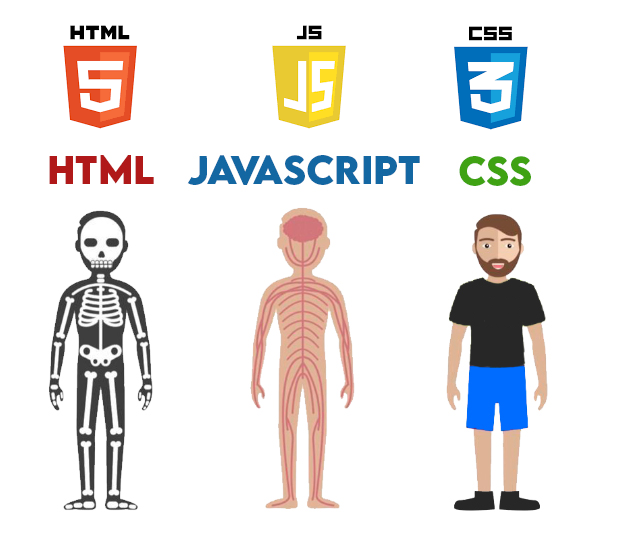

# Introducción a Javascript I

  

En esta sección vamos a comenzar con unos primeros pasos teóricos sobre la historia, tipos de lenguajes de programación y paradigmas, veremos que es javascript y como funciona, resolveremos algunas preguntas típicas y veremos que aplicaciones podemos utilizar para empezar a desarrollar Javascript.

Todas las páginas web están formadas por HTML, utilizado para construir la estructura de la página web (lenguaje de marcado) y CSS, que permite dar estilo a la página y construir una interfaz visual y agradable para los usuarios.

El uso exclusivo de HTML y CSS en una web nos limita considerablemente ya que, aunque podemos hacer un amplio abanico de cosas, la realización de algunas funciones de la web serían imposibles de hacer o mucho más complejas que si utilizamos el lenguaje de programación Javascript

- [Introducción a Javascript I](#introducción-a-javascript-i)
  - [Lenguajes de programación](#lenguajes-de-programación)
    - [Breve historia de los lenguajes de programación](#breve-historia-de-los-lenguajes-de-programación)
    - [Uso histórico de los lenguajes de programación](#uso-histórico-de-los-lenguajes-de-programación)
    - [Tipos de lenguajes de programación](#tipos-de-lenguajes-de-programación)
    - [Paradigma de programación](#paradigma-de-programación)
    - [Frontend vs Backend](#frontend-vs-backend)
    - [Ejecución de lenguajes de programación: Máquina virtual, compilación y ejecución directa](#ejecución-de-lenguajes-de-programación-máquina-virtual-compilación-y-ejecución-directa)
      - [Lenguajes más comunes para Backend o Frontend](#lenguajes-más-comunes-para-backend-o-frontend)
  - [¿Qué es Javascript?](#qué-es-javascript)
    - [¿Cómo funciona Javascript?](#cómo-funciona-javascript)
    - [¿Javascript es lo mismo que Java?](#javascript-es-lo-mismo-que-java)
    - [¿Es difícil aprender Javascript?](#es-difícil-aprender-javascript)
  - [Frameworks y librerias](#frameworks-y-librerias)
  - [Ecosistema de desarrollo](#ecosistema-de-desarrollo)

## Lenguajes de programación

Antes de entrar en materia y explicarte [qué es Javascript](#qué-es-javascript) quiero recordar algunos conceptos básicos sobre los lenguajes de programación en general.

### Breve historia de los lenguajes de programación

La historia de los lenguajes de programación se remonta a los primeros días de la informática. A medida que las computadoras surgieron en la década de 1940, se necesitaba un método más eficiente para comunicarse con ellas.
El primer lenguaje de alto nivel, **Fortran**, se desarrolló en la década de 1950 para **aplicaciones científicas**. A medida que la informática avanzaba, surgieron lenguajes como **COBOL** para **aplicaciones comerciales** y **C** y **Pascal** para **programación estructurada**. En la década de 1980, los **lenguajes orientados a objetos**, como **Smalltalk** y **C++**, ganaron popularidad. Con la llegada de Internet, **JavaScript** se convirtió en el **lenguaje principal para el desarrollo web**. A lo largo de los años, han surgido muchos lenguajes especializados en diferentes áreas. La historia de los lenguajes de programación es un reflejo del avance de la informática y sigue evolucionando para adaptarse a las demandas de la industria y la tecnología.

### Uso histórico de los lenguajes de programación

Los lenguajes de programación no son siempre iguales, se van actualizando, añadiendo o eliminando caracteristicas y funciones, o incluso van apareciendo nuevos lenguajes.

Esto es importante ya que permite que los lenguajes se adapten a las necesidades tanto de los programadores como de los usuarios y también permite arreglar funciones de seguridad del propio lenguaje.

>:soon: **EN EL HORNO** curso sobre seguridad en la web

Como ya hemos visto en el apartado de [breve historia de los lenguajes de programación](#breve-historia-de-los-lenguajes-de-programación) hay lenguajes que, aunque aún se usan, han perdido popularidad por dististas razones, por ejemplo PHP ha perdido popularidad debido a que nació NodeJS, que permite ejecutar Javascript del lado del servidor y tiene una sintaxis más sencilla con un mayor número de integraciones, librerías y frameworks

  

>:book:**PARA SABER MAS** la web de Tiobe genera anualmente una lista con los lenguajes más utilizados, puedes echarle un vistazo en esta web [Enlace a la página de Tiobe](https://www.tiobe.com/tiobe-index/)
>
> :gift_heart: **CONSEJO** estar al día sobre los lenguajes más utilizados es una buena práctica en cuanto a estar actualizado e ir aprendiendo los nuevos lenguajes que van saliendo. De esta forma estaremos preparados para los puestos de trabajo que encontremos

### Tipos de lenguajes de programación

Existen diferentes tipos de lenguajes de programación, cada uno con sus propias características y usos específicos. Aquí hay una descripción breve de algunos de los tipos más comunes:

1. Lenguajes de programación de **alto nivel**: Estos lenguajes están diseñados para ser más legibles y cercanos al lenguaje humano, lo que facilita la escritura y comprensión del código. Ejemplos de lenguajes de alto nivel incluyen **Python, Java, C++, JavaScript y Ruby**.

2. Lenguajes de programación de **bajo nivel**: Estos lenguajes están más cerca del lenguaje de máquina y permiten un mayor control sobre el hardware subyacente. Los lenguajes de bajo nivel se utilizan a menudo para programar sistemas operativos, controladores de dispositivos y aplicaciones de rendimiento crítico. Ejemplos de lenguajes de bajo nivel son el **ensamblador** y el lenguaje **C**.

3. Lenguajes de programación **orientados a objetos**: Estos lenguajes se basan en el concepto de "objetos" que encapsulan datos y funciones relacionadas. Permiten la reutilización de código, el encapsulamiento y la herencia. Algunos ejemplos son **Java, C++, Python y Ruby**.

4. Lenguajes de programación **funcionales**: Estos lenguajes se centran en el paradigma de la programación funcional, donde las funciones son tratadas como ciudadanos de primera clase y se evita el estado mutable. Ejemplos de lenguajes funcionales incluyen **Haskell, Lisp y Erlang.**

5. Lenguajes de programación de **scripting**: Estos lenguajes se utilizan principalmente para tareas de automatización y scripting. Son conocidos por su sintaxis más concisa y su capacidad para interactuar con otros programas y sistemas. Ejemplos de lenguajes de scripting son **Python, Ruby, Perl y PowerShell.**

6. Lenguajes de programación de **dominio específico (DSL)**: Estos lenguajes están diseñados para abordar problemas específicos en un dominio particular, como matemáticas, análisis de datos, manipulación de texto, entre otros. Ejemplos de DSL incluyen **R** para análisis estadístico y **SQL** para consultas de bases de datos.

### Paradigma de programación

Los lenguajes de programación también se pueden clasificar según el paradigma de programación que siguen. Un paradigma de programación define un enfoque o estilo particular para resolver problemas y organizar el código. Algunos de los paradigmas de programación más comunes son:

1. Programación **imperativa**: Se enfoca en describir cómo se deben realizar las tareas, utilizando instrucciones secuenciales y manipulación directa del estado. Ejemplos de lenguajes imperativos incluyen **C, Java y Python**.

2. Programación orientada a objetos **(POO)**: Se basa en el concepto de "objetos" que encapsulan datos y funciones relacionadas. Los objetos interactúan entre sí a través de mensajes, y se hace énfasis en la reutilización de código y la modularidad. Ejemplos de lenguajes orientados a objetos son **Java, C++, Python y Ruby**.

3. Programación **funcional**: Se centra en la evaluación de funciones matemáticas y evita el uso de variables y estado mutable. Las funciones se tratan como ciudadanos de primera clase y se enfatiza la inmutabilidad de los datos. Ejemplos de lenguajes funcionales incluyen **Haskell, Lisp y Clojure**.

4. Programación **declarativa**: Se centra en describir qué se quiere lograr en lugar de cómo hacerlo. Se especifica la lógica y las relaciones entre datos sin tener que definir los pasos detallados para lograr el resultado. Ejemplos de lenguajes declarativos son **SQL y Prolog.**

5. Programación **estructurada**: Se basa en la organización del código en estructuras lógicas y controladas, como bucles y condicionales, para mejorar la legibilidad y la mantenibilidad del código. Lenguajes como **C y Pascal** siguen este enfoque.

### Frontend vs Backend

En el desarrollo web, se distinguen dos áreas principales: frontend y backend.

- **Frontend**: El frontend se refiere a la parte visible y accesible de una aplicación o sitio web con la que los usuarios interactúan directamente. Los lenguajes de programación utilizados en el frontend suelen ser HTML, CSS y JavaScript. HTML define la estructura y el contenido de la página, CSS se encarga del diseño y la presentación visual, y JavaScript permite la interactividad y el comportamiento dinámico.

- **Backend**: El backend es la parte del desarrollo web que se ocupa del procesamiento y almacenamiento de datos, así como de la lógica de negocio. Aquí se utilizan lenguajes de programación como Java, Python, PHP y Ruby, así como frameworks y tecnologías como Node.js, Django y Laravel. El backend se encarga de manejar las solicitudes del cliente, acceder a bases de datos, realizar cálculos, implementar la lógica de la aplicación y enviar la respuesta al frontend.

El frontend y el backend trabajan juntos para ofrecer una experiencia completa al usuario. Mientras que el frontend se encarga de la interfaz de usuario y la interacción, el backend se encarga de los aspectos subyacentes que permiten que la aplicación funcione de manera eficiente y segura. Ambas áreas son esenciales para el desarrollo web exitoso.

  

### Ejecución de lenguajes de programación: Máquina virtual, compilación y ejecución directa

En el ámbito de la programación, existen diferentes enfoques para ejecutar el código de los lenguajes de programación. Algunos lenguajes requieren una máquina virtual, otros necesitan ser compilados y hay algunos que pueden ejecutarse directamente sin una etapa de compilación.

- **Máquina Virtual**: Algunos lenguajes de programación, como **Java** y **C#**, utilizan el concepto de máquina virtual. En estos casos, el código fuente se compila en un formato intermedio llamado bytecode. Luego, el bytecode se ejecuta en una máquina virtual específica para ese lenguaje, como la **Máquina Virtual de Java (JVM)** o el **Common Language Runtime (CLR) de .NET**. La máquina virtual interpreta y ejecuta el bytecode, lo que proporciona una capa de abstracción entre el código fuente y el sistema operativo subyacente. Esto permite que los programas escritos en lenguajes de máquina virtual sean portables, ya que pueden ejecutarse en diferentes sistemas operativos siempre que la máquina virtual correspondiente esté disponible.
- **Compilación**: Algunos lenguajes de programación, como **C, C++ y Pascal**, requieren un proceso de compilación antes de poder ejecutarse. Durante la etapa de compilación, el código fuente se traduce en instrucciones de bajo nivel específicas de la plataforma objetivo. El compilador analiza el código fuente, verifica su validez y genera un archivo ejecutable o una biblioteca de enlace dinámico (DLL) que puede ser ejecutado directamente por el sistema operativo. La compilación produce un código binario optimizado para la plataforma específica, lo que generalmente resulta en una mayor eficiencia y rendimiento en comparación con los lenguajes interpretados o de máquina virtual.
- **Ejecución directa**: Por otro lado, hay lenguajes de programación como **JavaScript, Python y Ruby** que utilizan un enfoque de ejecución directa. Estos lenguajes no requieren un proceso de compilación previo, sino que su código fuente se interpreta directamente en tiempo de ejecución. Un intérprete lee el código fuente línea por línea y lo ejecuta de forma secuencial. Esto permite una mayor flexibilidad y agilidad en el desarrollo, ya que los cambios en el código pueden reflejarse inmediatamente sin tener que pasar por un proceso de compilación. Sin embargo, este enfoque puede resultar en una ejecución más lenta en comparación con los lenguajes compilados o los que utilizan máquina virtual.

La elección de utilizar una máquina virtual, compilación o ejecución directa depende de varios factores, como los objetivos del lenguaje, los requisitos de rendimiento, la portabilidad y las características específicas del lenguaje. Cada enfoque tiene sus ventajas y desventajas, y es importante seleccionar el enfoque adecuado según las necesidades del proyecto y las limitaciones del entorno de desarrollo.

#### Lenguajes más comunes para Backend o Frontend

| Backend    | Frontend         |
|------------|----------------- |
| Java       | HTML             |
| Python     | CSS              |
| PHP        | JavaScript       |
| Ruby       | TypeScript       |
| C#         | Sass (preprocesador CSS) |
| Go         | Kotlin           |

## ¿Qué es Javascript?

  

Una vez explicado los conceptos básicos ya podemos responder a la pregunta ¿Qué es Javascript?

Javascript en un lenguaje programación de alto nivel que nos permite establecer que tareas debe realizar, en que orden y cuantas veces nuestra página o aplicación web.

Como hemos visto en el apartado de [Ejecución de lenguajes de programación: Máquina virtual, compilación y ejecución directa](#ejecución-de-lenguajes-de-programación-máquina-virtual-compilación-y-ejecución-directa), Javascript se ejecuta directamente en el navegador del ciente, lo que permite agregar interactividad y dinamismo a las páginas web.

Proporciona una serie de características poderosas que permiten manipular y controlar elementos del HTML, responder a eventos del usuario, realizar solicitudes de red, almacenar y recuperar datos localmente, crear animaciones, videojuegos y un largo etcétera. Además, con la llegada de [frameworks](#frameworks-y-librerias) se ha expandido más alla del navegador web y ahora también se utiliza en desarrollo backend en servidor, aplicaciones móviles y aplicaciones de excritorio.

Una de las características más poderosas de Javascript es su capacidad de trabajar de manera asíncrona, lo que significa que puede manejar múltiples tareas simultáneamente sin bloquear la ejecución del programa. Esto se consigue mediante el uso de devoluciones de llamada (callbacks), promesas (ya en desuso) y funciones asíncronas/await.

JavaScript ha evolucionado mucho desde sus primeros días, y actualmente existen varios estándares y versiones del lenguaje. La especificación más reciente es ECMAScript 2022 (también conocido como ES2022 o ES12), que introdujo muchas nuevas características y mejoras en el lenguaje.

>:books: **PARA SABER MÁS** Javascript en un inicio (años 90) se llamó 'Mocha' pero debido a que su desarrollador Brendran Eich aprovechó la popularidad del lenguaje 'Java' decidió cambiarle el nombre al actual 'Javascript' para que la gente lo asociase a 'Java'. Pero... [¿Javascript es lo mismo que Java?](#javascript-es-lo-mismo-que-java)

### ¿Cómo funciona Javascript?

El objetivo principal de Javascript es agregar interactividad y dinamismo a las páginas web. A diferencia de HTML y CSS, que se centran en la estructura y el estilo de una página web.

Cuando visitas una página web que utiliza JavaScript, el navegador web descarga el código JavaScript junto con el HTML y el CSS. A medida que el navegador encuentra código JavaScript, lo ejecuta y realiza las acciones correspondientes.
JavaScript puede realizar una amplia variedad de tareas, como:

- **Manipulación del contenido HTML**: JavaScript puede modificar y manipular elementos HTML existentes en una página web. Por ejemplo, cambiar el texto de un elemento, agregar o eliminar elementos, cambiar el estilo de un elemento, etc.
- **Interacciones del usuario**: JavaScript permite responder a las acciones del usuario, como hacer clic en un botón, pasar el mouse sobre un elemento o enviar un formulario. Puedes definir funciones en JavaScript que se activan cuando ocurren estos eventos.
- **Obtener y modificar datos**: JavaScript puede interactuar con servidores y bases de datos, enviar solicitudes para obtener datos actualizados y actualizar la página web en consecuencia. Esto permite crear aplicaciones web dinámicas que muestran información actualizada.
- **Validación de formularios**: Puedes utilizar JavaScript para verificar y validar los datos ingresados por los usuarios en formularios web antes de enviarlos al servidor.
- **Animaciones y efectos visuales**: JavaScript permite crear animaciones y efectos visuales llamativos en una página web. Esto se logra manipulando propiedades CSS y utilizando funciones y bibliotecas especializadas.

> :soon: **EN EL HORNO** curso sobre "Como funciona Javascript. Behind the scenes" en el que trataremos el funcionamiento real de Javascript desde una vista más técnica y más compleja.

### ¿Javascript es lo mismo que Java?

Aunque los nombres son similares, JavaScript y Java son dos lenguajes de programación distintos con características y aplicaciones diferentes. Aquí tienes una breve explicación y una tabla comparativa de algunas de las principales diferencias:

| JavaScript | Java |
|------------|------|
| Lenguaje de programación interpretado | Lenguaje de programación compilado |
| Orientado a la programación en el lado del cliente (navegador web) | Orientado a la programación en el lado del servidor |
| Principalmente utilizado para el desarrollo web y aplicaciones del lado del cliente | Utilizado para una amplia variedad de aplicaciones, incluyendo aplicaciones empresariales y de escritorio |
| Sintaxis similar a otros lenguajes de programación como C y C++ | Sintaxis similar a C++ |
| Tipado dinámico y débil | Tipado estático y fuerte |
| Soporta programación orientada a objetos y funcional | Soporta programación orientada a objetos |
| No tiene conceptos de clases o herencia de clases | Utiliza clases y soporta herencia de clases |
| Utiliza una máquina virtual incorporada en el navegador web (runtime) | Utiliza la Máquina Virtual de Java (JVM) para ejecutar el código |
| No requiere un proceso de compilación previo | Requiere un proceso de compilación para generar un archivo ejecutable |

En resumen, aunque JavaScript y Java comparten algunas similitudes en la sintaxis, son lenguajes de programación distintos con propósitos y aplicaciones diferentes. JavaScript se utiliza principalmente para el desarrollo web y aplicaciones del lado del cliente, mientras que Java se utiliza en una amplia variedad de aplicaciones empresariales y de escritorio, tanto en el lado del servidor como en el lado del cliente.

### ¿Es difícil aprender Javascript?

No hay una respuesta válida a esta pregunta ya que depende de con que lenguajes lo compares ya que puede variar según la experiencia previa en programación y el enfoque de aprendizaje de cada persona.

Una comparación común es: HTML y CSS vs Javascript, Si comparamos la curva de aprendizaje entre HTML y CSS y Javascript podemos observar que, Javascript, es algo más complejo ya que tenemos que tener unos fundamentos de lógica de programación y tenemos que conocer sus estructuras de control básicas.

Aunque esta comparación no es justa ya que HTML y CSS no son considerados lenguajes de programación, sino de marcado, por lo que deberíamos comparar Javascript con otros lenguajes de programación, por ejemplo PHP.
Al comparar Javascript y PHP resalta que la sintaxis y el uso de PHP es bastante más compleja que Javascript

Otra comparación bastante común (debido al nombre) es Java vs Javascript,  en esta comparación sale ganando Javascript ya que , Java, tiene un fuerte tipado y requiere un proceso de compilación previo, lo cual puede agregar una capa adicional de complejidad al aprendizaje.

A continuación, te menciono algunos aspectos que pueden influir en la percepción de dificultad al aprender JavaScript:

- **Sintaxis amigable**: JavaScript tiene una sintaxis similar a otros lenguajes de programación como C y C++, lo cual facilita su comprensión y aprendizaje si ya se tiene familiaridad con esos lenguajes.
- **Abundancia de recursos**: Dado que JavaScript es ampliamente utilizado en el desarrollo web, hay una gran cantidad de recursos disponibles en línea, como tutoriales, documentación y cursos interactivos, que facilitan el proceso de aprendizaje.
- **Comunidad activa**: La comunidad de JavaScript es muy activa y colaborativa, lo que significa que puedes encontrar fácilmente ayuda, consejos y ejemplos de código en foros, comunidades en línea y grupos de desarrolladores.
- **Versatilidad y aplicaciones prácticas**: JavaScript se utiliza tanto en el lado del cliente (navegadores web) como en el lado del servidor (Node.js), lo que amplía las oportunidades de desarrollo y aplicación práctica. Esto hace que aprender JavaScript sea valioso para el desarrollo web y otros escenarios.

## Frameworks y librerias

Los frameworks y las librerías son herramientas utilizadas en el desarrollo de software, incluyendo aplicaciones web, para facilitar y agilizar el proceso de programación. Aunque tienen funciones similares, existen diferencias clave entre ellos.

- **Librerías**: Una librería es un conjunto de funciones y métodos predefinidos que se pueden utilizar en una aplicación. Estas funciones abstraen tareas comunes y permiten a los desarrolladores reutilizar código, ahorrando tiempo y esfuerzo en la implementación de ciertas funcionalidades. Algunas librerías populares de JavaScript son:
  - **jQuery**: Una librería que simplifica la manipulación del DOM, manejo de eventos y ejecución de animaciones en aplicaciones web.
  - **Lodash**: Proporciona funciones de utilidad que ayudan en el manejo de datos, manipulación de cadenas, operaciones matemáticas, etc.
  - **Axios**: Una librería para realizar peticiones HTTP desde el navegador o Node.js de forma sencilla y eficiente.

- **Frameworks**: Un framework es una infraestructura más completa que proporciona una estructura y una serie de pautas para el desarrollo de aplicaciones. A diferencia de una librería, un framework impone una arquitectura específica y dicta cómo debe organizarse el código de la aplicación. Un framework puede proporcionar componentes predefinidos, abstracciones de alto nivel, herramientas de manejo de estado y enrutamiento, entre otros. Algunos frameworks populares de JavaScript son:
  - **React**: Un framework de código abierto desarrollado por Facebook. Se utiliza para construir interfaces de usuario interactivas y reactivas. React se basa en el concepto de componentes reutilizables y utiliza un enfoque declarativo para actualizar y renderizar la interfaz de usuario.
  - **Angular**: Un framework de desarrollo de aplicaciones web creado por Google. Angular ofrece una estructura sólida y completa para el desarrollo de aplicaciones, incluyendo características como enrutamiento, manejo de estado y una arquitectura basada en componentes.
  - **Vue**: Un framework progresivo y fácil de aprender que permite construir interfaces de usuario interactivas. Vue se enfoca en la capa de vista de una aplicación y se integra fácilmente con otros proyectos existentes.

## Ecosistema de desarrollo

El ecosistema de desarrollo de Javascript se refiere a la amplia gama de herramientas, bibliotecas, frameworks, recursos disponibles para trabajar con Javascript y facilitar el desarrollo de aplicaciones.

Algunos de los componentes clave del ecosistema de desarrollo de Javascript:

- **Editores de código**: **Visual Studio Code, Sublime Text y Atom** brindan características avanzadas para la edición y escritura de código JavaScript, como resaltado de sintaxis, autocompletado y depuración.
- **Sistemas de gestión de paquetes**: **npm** (Node Package Manager) y **Yarn**, permiten a los desarrolladores compartir, instalar y gestionar fácilmente paquetes y dependencias de JavaScript en sus proyectos.
- **Bundler y gestores de módulos**: **Webpack, Parcel y Rollup** ayudan a gestionar y agrupar los módulos de JavaScript de una aplicación, permitiendo una mejor organización del código y mejorando el rendimiento mediante la optimización y concatenación de archivos.
- **Frameworks y librerías**:  **React, Angular, Vue, Express, entre otros**. Estos frameworks proporcionan una estructura y conjunto de herramientas para simplificar tareas comunes y acelerar el desarrollo.
- **Testing y herramientas de depuración**: **Jest, Mocha y Cypress**, que permiten realizar pruebas automatizadas en el código JavaScript.

>:pencil:**NOTA** Además, las herramientas de depuración como las consolas de desarrollador de los navegadores, el debugger de Node.js y las extensiones de Chrome DevTools, ayudan a identificar y corregir errores en el código.

- **Comunidades y recursos de aprendizaje**: La comunidad de JavaScript es muy activa y cuenta con numerosos recursos de aprendizaje en línea, como documentación oficial, tutoriales, blogs, foros y comunidades en redes sociales.

