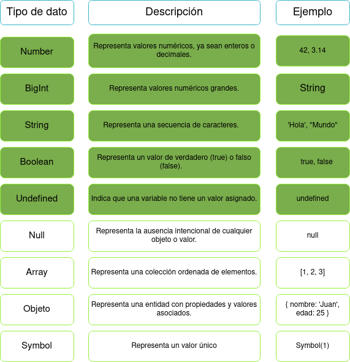
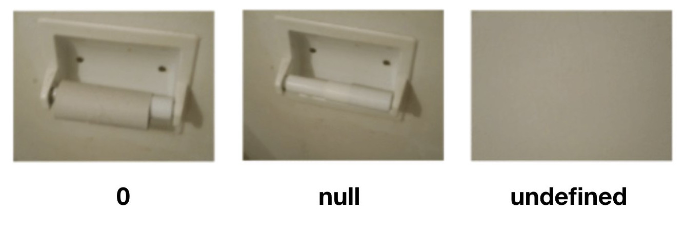

# Introducción a Javascript II

En la anterior sección [Introducción a Javascript I](./00_introduccion.md) veíamos los conceptos generales sobre los lenguajes de programación, nos introducíamos en la historia y los tipos de lenguajes y paradigmas de programación y veíamos unos conceptos sobre Javascript.

En este apartado, vamos a comenzar a tocar código viendo los tipos de datos, operadores, variables, como establecer comentarios, las distintas ubicaciones de Javascript, etc..

- [Introducción a Javascript II](#introducción-a-javascript-ii)
  - [Variables y constantes](#variables-y-constantes)
    - [¿Qué son las constantes?](#qué-son-las-constantes)
    - [Scope de las variables y constantes](#scope-de-las-variables-y-constantes)
  - [Tipos de datos](#tipos-de-datos)
    - [Tipos de datos primitivos](#tipos-de-datos-primitivos)
    - [¿Es lo mismo `NULL` que `UNDEFINED`?](#es-lo-mismo-null-que-undefined)
    - [Tipado fuerte vs tipado débil](#tipado-fuerte-vs-tipado-débil)
    - [¿Cómo sé que tipo de dato tiene una variable?](#cómo-sé-que-tipo-de-dato-tiene-una-variable)
      - [``typeof()``](#typeof)
      - [``constructor.name``](#constructorname)
  - [Operadores](#operadores)
    - [Aritméticos](#aritméticos)
    - [Lógicos](#lógicos)
    - [Comparación](#comparación)
  - [Comentarios](#comentarios)
    - [Comentarios de una línea](#comentarios-de-una-línea)
    - [Comentarios de múltiples líneas o bloque](#comentarios-de-múltiples-líneas-o-bloque)
  - [Especificacion ECMAScript](#especificacion-ecmascript)

## Variables y constantes

La primera toma de contacto son las variables. Las variables son contenedores que se utilizan para almacenar datos. Se declaran utilizando las palabras clave var, let o const.

>:pencil:**NOTA** Javascript también permite la declaración automatica de variables por lo que no es necesario el uso de var o let, aunque no es recomendable evitar el uso de let y var ya que perjudica la legibilidad del código.

- **var**: se utilizaba en versiones antiguas de JavaScript, concretamente desde 1995 a 2015

> :heavy_exclamation_mark: **NO RECOMENDADO** no se recomienda el uso de **var** actualmente

~~~js
var nombre_variable = valor_variable
~~~

- **let**: nueva forma de declarar variables añadida en [ECMASscript6](#especificacion-ecmascript) a partir de 2015

~~~js
let nombre_variable = valor_variable
~~~

- **const**: forma de clarar constantes

~~~js
const NOMBRE_VARIABLE = valor_variable
~~~

### ¿Qué son las constantes?

Como ya hemos definido en el apartado anterior, las variables son contenedores de datos que pueden variar su valor según la ejecución del código pero hay veces que es necesario que una variable mantenga su valor durante toda la ejecución del código. Para esos casos es donde se utilizan las constantes, contenedores de datos que **NUNCA** modifican su valor, una vez asignado el valor le mantendrán durante toda la ejecución.

Es recomendable seguir unas guías de buenas prácticas cuando utilicemos constantes:

- **Mayusculas**: Convierte el nombre de las constantes en mayúsculas para resaltar que son constantes y no variables.
- **Inicialización al declarar**: Asegúrate de asignar un valor a la constante en el momento de su declaración. Esto evita confusiones y errores más adelante en el código. 
- **Evita reasignaciones**: No intentes cambiar el valor de una constante después de haberla declarado. Si necesitas un valor mutable, considera utilizar una variable en su lugar.
- **Alcance apropiado**: Declara tus constantes en el alcance más cercano posible a donde se utilizan. Esto ayuda a limitar su visibilidad y evitar colisiones de nombres con otras variables o constantes.
- **Documentación**: Si trabajas en un equipo o compartes tu código con otros desarrolladores, es una buena práctica proporcionar documentación clara sobre el propósito y uso de tus constantes. Esto facilita la comprensión del código y ayuda a otros desarrolladores a utilizar tus constantes de manera adecuada.

### Scope de las variables y constantes

El scope o alcance de las variables y constantes se refiere a la visibilidad y accesibilidad de estas dentro de un programa. Indica qué partes del código pueden acceder y utilizar una determinada variable o constante, así como cuándo se crea y destruye su espacio de almacenamiento.

- **Scope global**: Las variables y constantes declaradas fuera de cualquier función tienen un alcance global. Esto significa que se pueden acceder a ellas desde cualquier parte del programa, ya sea dentro de funciones, bloques de código o en el ámbito global. Las variables globales permanecen en memoria durante toda la ejecución del programa y pueden ser accedidas y modificadas en cualquier momento.
- **Scope local**: Las variables y constantes declaradas dentro de una función tienen un alcance local. Esto significa que solo pueden ser accedidas y utilizadas dentro de la función en la que se declaran. Estas variables locales solo existen mientras la función está en ejecución y se destruyen una vez que la función finaliza su ejecución. Cada función tiene su propio scope local, lo que significa que las variables con el mismo nombre pueden existir en diferentes funciones sin causar conflictos.

~~~js
var globalVariable = "Soy una variable global"; // Variable global

function myFunction() {
  var localVariable = "Soy una variable local"; // Variable local dentro de la función

  console.log(globalVariable); // Accediendo a la variable global desde la función
  console.log(localVariable); // Accediendo a la variable local desde la función
}

console.log(globalVariable); // Accediendo a la variable global desde el ámbito global
console.log(localVariable); // Error: localVariable is not defined, no se puede acceder desde el ámbito global

myFunction(); // Llamando a la función para imprimir los valores de las variables dentro de ella
~~~

## Tipos de datos

Antes de asignar valor tenemos que ser conscientes de que tipos de datos existen, en esta tabla podemos ver todos los tipos de datos en Javascript

  

En esta tabla puedes ver todos los tipos de datos que existen en Javascript, las filas marcadas con color verde de fondo son los [tipos de datos primitivos](#tipos-de-datos-primitivos)

### Tipos de datos primitivos

Los tipos de datos primitivos en programación son los tipos de datos básicos y fundamentales que se utilizan para representar y manipular valores en un lenguaje de programación. Son los bloques de construcción fundamentales en la creación de programas.

Características principales:

- **Inmutables**: Los valores de los tipos de datos primitivos no pueden modificarse directamente. Si se realiza una operación que parece modificar el valor, en realidad se crea un nuevo valor y se asigna a una nueva variable.
- **Valores simples**: Representan valores individuales y simples. No contienen propiedades o métodos adicionales.
- **Se almacenan por valor**: Se asigna un valor de un tipo de dato primitivo a una variable, se copia el valor completo en la variable.

La principal diferencia entre los tipos de datos primitivos y los tipos de datos complejos radica en cómo se almacenan y se manipulan. Mientras que los tipos de datos primitivos se almacenan directamente en una variable y se pasan por valor, los tipos de datos complejos (como objetos, arreglos, funciones, etc.) se almacenan por referencia, lo que significa que se guarda una referencia o dirección de memoria a la ubicación real del dato.

### ¿Es lo mismo `NULL` que `UNDEFINED`?

  

No, null y undefined son dos valores distintos en JavaScript y tienen significados diferentes.

null es un valor que se utiliza para indicar la ausencia intencional de cualquier objeto o valor. Se utiliza cuando se quiere expresar que una variable no tiene un valor válido o que no apunta a ningún objeto. Puedes asignar explícitamente el valor null a una variable para indicar que no tiene ningún valor asignado.

Por otro lado, undefined se utiliza para indicar que una variable ha sido declarada pero no se le ha asignado ningún valor. Si intentas acceder a una variable que está declarada pero no inicializada, su valor será undefined. También se obtiene como resultado cuando se accede a una propiedad de un objeto que no existe.

### Tipado fuerte vs tipado débil

El tipado fuerte y el tipado débil se refieren a cómo se manejan las conversiones de tipos en un lenguaje de programación. En un lenguaje de tipado fuerte, las conversiones deben realizarse explícitamente, mientras que en un lenguaje de tipado débil, las conversiones pueden ocurrir automáticamente. Cada enfoque tiene sus ventajas y desventajas, y es importante comprender cómo funciona el tipado en el lenguaje que estemos utilizando para evitar errores y resultados inesperados.

Ejemplo de tipado fuerte (Java)

~~~js
int num1 = 5;
String str1 = "10";
int sum = num1 + Integer.parseInt(str1); // Conversión explícita de String a int
System.out.println(sum); // Resultado: 15
~~~

Ejemplo de tipado débil (Javascript)

~~~js
var num2 = 5;
var str2 = "10";
var sum = num2 + str2; // Conversión implícita de int a string
console.log(sum); // Resultado: "510"
~~~

### ¿Cómo sé que tipo de dato tiene una variable?

Javascript, a diferencia de otros lenguajes, no tiene un [fuerte tipado](#tipado-fuerte-vs-tipado-débil) por lo que no es necesario declarar el tipo de dato que contiene una variable y, además, esa variable puede ir cambiando el tipo de dato que contiene según la ejecución asi que, en algunas ocasiones, se vuelve algo confuso intuir que tipo de dato contiene.
Este problema le podemos solventar de varias formas, la primera es a través de un operador unario ``typeof`` o utilizando la propiedad ``name`` del objeto ``constructor``.

Vamos a detallarlos y ver su implementación:

Tenemos estas variables definidas que usaremos para aplicar ambos métodos:

~~~js
var texto = "el famoso Hola Mundo"
var numero = 26
var booleano = true
var nodefinida
var nula = null
var objeto = new Objeto ()
~~~

#### ``typeof()``

Es un operador unario que nos permite conocer el valor de una variable.

Estos son los posibles valores de retorno

| Tipo de dato | Descripción                                          |
|--------------|------------------------------------------------------|
| undefined    | Indica que el valor es `undefined`.                   |
| boolean      | Indica que el valor es de tipo booleano.              |
| number       | Indica que el valor es de tipo numérico.              |
| string       | Indica que el valor es de tipo cadena de texto.       |
| symbol       | Indica que el valor es de tipo símbolo.               |
| object       | Indica que el valor es de tipo objeto o `null`.       |
| function     | Indica que el valor es de tipo función.               |

~~~js
console.log(typeof texto) // String
console.log(typeof numero) // Number
console.log(typeof booleano) // Boolean
console.log(typeof nodefinida) // undefined
console.log(typeof nula) // object
console.log(typeof persona) // object
~~~

> :woman_teacher: **EXPLICACIÓN** operadores unarios son aquellos que actúan sobre un único valor o variable. Por ejemplo: typeof x devolvería una cadena de texto que indica el tipo de x.
>
> :warning: **ADVERTENCIA** es importante destacar que typeof tiene algunas peculiaridades. Por ejemplo, typeof null devuelve "object" en lugar de "null", lo cual es una inconsistencia histórica en JavaScript.
>
> :warning: **ADVERTENCIA** typeof no sirve para tipos de datos complejos ya que siempre devuelve ``object``

#### ``constructor.name``

Llegados a este punto podemos ver que el uso de ``typeof`` nos puede resultar ineficiente por que no podemos evaluar tipos de datos complejos. Aquí es donde entra ``constructor.name``.
``constructor.name`` es una propiedad que se puede utilizar en JavaScript para obtener el nombre de la función constructora de un objeto.

~~~js
console.log(texto.constructor.name);  // "String"
console.log(numero.constructor.name);  // "Number"
console.log(booleano.constructor.name);  // "Boolean"
console.log(nodefinida.constructor.name);  // "undefined"
console.log(nula.constructor.name);  // Error: null no tiene un constructor
console.log(objeto.constructor.name); // Objeto
~~~

> :warning: **ADVERTENCIA** es importante mencionar que en JavaScript, la propiedad constructor puede ser modificada y no siempre reflejará el tipo real del objeto. Por ejemplo, en el caso de null, su constructor apunta a Object debido a una peculiaridad del lenguaje.

## Operadores

Los operadores en JavaScript son símbolos o palabras clave que se utilizan para realizar operaciones en expresiones y manipular valores. Hay diferentes tipos de operadores en JavaScript, incluyendo operadores aritméticos, operadores lógicos y operadores de comparación.

### Aritméticos

Los operadores aritméticos se utilizan para realizar operaciones matemáticas en valores numéricos. Estos operadores incluyen:

- Suma (**+**): Se utiliza para sumar dos valores.
- Resta (**-**): Se utiliza para restar un valor de otro.
- Multiplicación (**`*`**): Se utiliza para multiplicar dos valores.
- División (**/**): Se utiliza para dividir un valor por otro.
- Módulo (**%**): Se utiliza para obtener el resto de la división entre dos valores.
- Incremento (**++**): Se utiliza para aumentar en 1 el valor de una variable.
- Decremento (**--**): Se utiliza para disminuir en 1 el valor de una variable.

~~~js
var x = 5;
var y = 3;
var suma = x + y; // Resultado: 8
var resta = x - y; // Resultado: 2
var multiplicacion = x * y; // Resultado: 15
var division = x / y; // Resultado: 1.6666666666666667
var modulo = x % y; // Resultado: 2
x++; // Incremento de x, ahora x es igual a 6
y--; // Decremento de y, ahora y es igual a 2
~~~

### Lógicos

Los operadores lógicos se utilizan para evaluar expresiones lógicas y devolver un valor booleano (true o false). Estos operadores incluyen:

- AND lógico (**&&**): Devuelve true si ambas expresiones son verdaderas.
- OR lógico (**||**): Devuelve true si al menos una de las expresiones es verdadera.
- NOT lógico (**!**): Niega el valor de una expresión, si es true devuelve false, y viceversa.

~~~js
var a = true;
var b = false;
var resultadoAnd = a && b; // Resultado: false
var resultadoOr = a || b; // Resultado: true
var resultadoNot = !a; // Resultado: false
~~~

### Comparación

Los operadores de comparación se utilizan para comparar valores y devolver un valor booleano. Estos operadores incluyen:

- Igual (**== o ===**): Compara si dos valores son iguales.
- No igual (**!= o !==**): Compara si dos valores no son iguales.
- Mayor que (**>**): Compara si un valor es mayor que otro.
- Menor que (**<**): Compara si un valor es menor que otro.
- Mayor o igual que (**>=**): Compara si un valor es mayor o igual que otro.
- Menor o igual que (**<=**): Compara si un valor es menor o igual que otro.

~~~js
var x = 5;
var y = 3;
var resultadoIgual = x == y; // Resultado: false
var resultadoMayor = x > y; // Resultado: true
var resultadoMenorIgual = x <= y; // Resultado: false
~~~

## Comentarios

Los comentarios en JavaScript son texto o anotaciones que se agregan al código para brindar explicaciones, aclaraciones o notas sobre el funcionamiento del programa. Los comentarios no se ejecutan ni afectan el resultado final del código, su único propósito es proporcionar información adicional para facilitar la comprensión del código a otras personas que lo lean.

### Comentarios de una línea

Los comentarios de una línea se utilizan para agregar notas breves en una sola línea de texto. Estos comentarios comienzan con dos barras diagonales (//)

~~~js
// Este es un comentario de una línea
~~~

### Comentarios de múltiples líneas o bloque

Los comentarios de múltiples líneas se utilizan para agregar notas más extensas o para comentar bloques de código completos. Estos comentarios comienzan con una barra diagonal seguida de un asterisco (/*) y finalizan con un asterisco seguido de una barra diagonal (*/).

~~~js
/* Este es un comentario de múltiples líneas
   que abarca varias líneas de texto.
   Puede ser utilizado para explicar el propósito de un bloque de código. */
~~~

## Especificacion ECMAScript

ECMAScript es una especificación de lenguaje de programación que define las reglas y normas para el funcionamiento de JavaScript y otros lenguajes similares. Especifica la sintaxis, el comportamiento y las características del lenguaje, lo que permite que los diferentes motores de JavaScript implementen estas reglas y ofrezcan una funcionalidad coherente en diferentes entornos.

Cada versión de ECMAScript introduce nuevas características, mejoras y actualizaciones en el lenguaje. Por ejemplo, ECMAScript 6 (también conocido como ES6 o ES2015) introdujo características como clases, módulos, funciones de flecha y destructuring, entre otras. Versiones posteriores, como ECMAScript 7 (ES7 o ES2016), ECMAScript 8 (ES8 o ES2017) y así sucesivamente, continúan añadiendo nuevas funcionalidades y mejoras al lenguaje.
