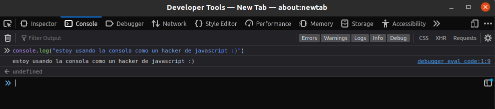
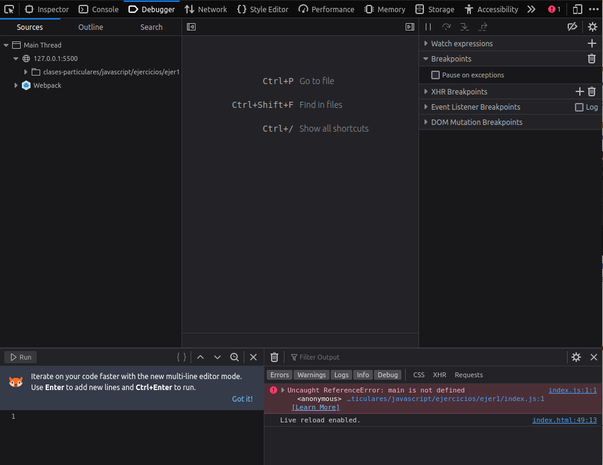

# Uso de Javascript

En las dos secciones anteriores, [Introducción a Javascript I](00_introduccion.md),  [Introducción a Javascript II](01_introduccion.md) y [Estructuras de control](02_estructuras_control.md) hemos visto la teoría básica sobre Javascript y la sintaxis e implementación de las distintas estructuras de control pero... ¡YA BASTA DE TEORÍA! VAMOS A CODEAR

- [Uso de Javascript](#uso-de-javascript)
  - [Como ejecutar Javascript](#como-ejecutar-javascript)
    - [Ejecutando en consola](#ejecutando-en-consola)
    - [Ejecutando en navegador](#ejecutando-en-navegador)
    - [Otras formas de ejecutar Javascript](#otras-formas-de-ejecutar-javascript)
  - [Cómo enlazar o agregar código Javascript](#cómo-enlazar-o-agregar-código-javascript)
    - [Vincular un archivo externo](#vincular-un-archivo-externo)
    - [Insertar código directamente en HTML](#insertar-código-directamente-en-html)

## Como ejecutar Javascript

El primer paso para poder codear es ver las distintas formas que tenemos de ejecutar el código Javascript.

### Ejecutando en consola

> :pencil: **NOTA** los ejemplos están realizados sobre Mozilla Firefox pero es aplicable a los principales navegadores

Es probable que nunca te hayas fijado, o hayas entrado accidentalmente, en esta herramienta que poseen los navegadores ya que no es notable en el uso diario de un navegador, me refiero a **inspeccionar(F12)**
Puedes acceder abriendo una ventana de tu navegador y pulsando la tecla ``F12`` o ``click der + inspeccionar``

> :books: **PARA SABER MÁS** ya está disponible una sección donde vemos en profundidad esta poderosísima herramienta de Inspeccionar [Ver sección Inspeccionar(F12) en profundidad]()

Por el momento nos vamos a centrar únicamente en la opción de **consola** que ofrece esta herramienta. Gracias a consola podemos ejercutar y probar nuestro código y ver los resultados para depurarlos y todo directamente desde el navegador.

  

La consola del navegador también ofrece herramientas de depuración, como puntos de interrupción, seguimiento de llamadas y más. Estas herramientas te permiten inspeccionar el estado de tu código, realizar un seguimiento de las variables y solucionar problemas.

  

### Ejecutando en navegador

También tienes la opción de ejecutar el código directamente en el navegador sin abrir herramientas. Para ejecutar código JavaScript en un navegador, puedes incluirlo en tu archivo HTML utilizando las etiquetas ``
</body>
</html>
~~~

### Otras formas de ejecutar Javascript

Además de ejecutar JavaScript en la consola del navegador y mediante la inclusión de código en un archivo HTML, existen otras formas de ejecutar JavaScript en diferentes entornos y contextos. Algunas de estas formas incluyen:

- **Node.js**: Node.js es un entorno de tiempo de ejecución de JavaScript basado en el motor V8 de Chrome. Permite ejecutar código JavaScript en el servidor o en la línea de comandos, lo que lo hace útil para la creación de aplicaciones del lado del servidor. Puedes ejecutar scripts de JavaScript con Node.js utilizando el comando node seguido del nombre del archivo. Por ejemplo: node mi_script.js.
- **Extensiones y complementos del navegador**: Algunos navegadores permiten crear extensiones o complementos que pueden ejecutar código JavaScript en el contexto del navegador. Estas extensiones o complementos pueden agregar funcionalidad adicional a los sitios web o modificar su comportamiento. Los desarrolladores pueden escribir código JavaScript para extender las capacidades del navegador.
- **Herramientas de automatización de pruebas**: Existen herramientas de automatización de pruebas como Selenium o Puppeteer que permiten ejecutar código JavaScript para automatizar pruebas en aplicaciones web. Estas herramientas simulan la interacción de un usuario con la aplicación y pueden ejecutar secuencias de comandos escritas en JavaScript para verificar el funcionamiento correcto de la aplicación.
- **Entornos de desarrollo integrados (IDE)**: Los IDEs populares para desarrollo web, como Visual Studio Code, Atom o WebStorm, tienen soporte para la ejecución de código JavaScript directamente dentro del editor. Esto facilita la prueba y la depuración del código sin la necesidad de abrir un navegador o una consola externa.

## Cómo enlazar o agregar código Javascript

### Vincular un archivo externo

> :white_check_mark: **RECOMENDADO**

La forma más recomendada de agregar código JavaScript a tu página web es vinculando un archivo externo. Esto implica crear un archivo separado con extensión .js que contenga tu código JavaScript y luego enlazarlo en tu archivo HTML.

Para vincular un archivo JavaScript externo, sigue estos pasos:

1. Crea un archivo nuevo con extensión .js, por ejemplo, script.js. Puedes utilizar cualquier editor de texto para crear este archivo.
2. Escribe tu código JavaScript dentro de este archivo. Puedes incluir todas tus funciones, variables y lógica de programación en este archivo.

    Ejemplo de script.js:

    ~~~js
    function saludar() {
    console.log("Hola, mundo!");
    }

    var numero = 42;
    ~~~

3. Guarda el archivo .js en la misma carpeta o directorio que tu archivo HTML.
4. En tu archivo HTML, dentro de la etiqueta ``<head>`` o antes del cierre de la etiqueta ``<body>``, agrega una etiqueta de script con el atributo src que apunte al archivo JavaScript externo.

    Ejemplo de enlace de archivo JavaScript en HTML:

    ~~~html
    <html>
    <head>
        <title>Mi página web</title>
        
    </head>
    <body>
        <!-- Contenido de tu página -->
    </body>
    </html>
    ~~~

### Insertar código directamente en HTML

> :heavy_exclamation_mark: **NO RECOMENDADO** ya que es más escalable, fácil de leer y de mantener tener el código Javascript en fichero separado, tal y como hemos visto en el apartado anterior

Si bien se recomienda vincular un archivo externo para el código JavaScript, también es posible insertar el código directamente en el archivo HTML utilizando la etiqueta ``
    </head>
    <body>
        <!-- Contenido de tu página -->
    </body>
    </html>
    ~~~

Al insertar el código directamente en el archivo HTML, el código se ejecutará en la ubicación donde se encuentra. Sin embargo, si tienes mucho código JavaScript, puede volverse difícil de mantener y depurar.
