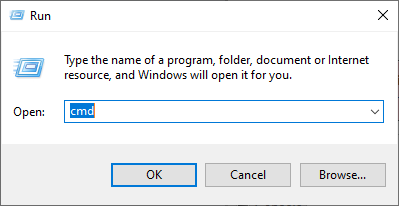

# Configuración del entorno y primeros pasos

## Configuración del entorno

Entorno Windows

### Entorno Windows

>XAMPP es un software que se utiliza para crear y administrar sitios web en un ordenador personal y es como una caja de herramientas que contiene todo lo necesario para hacerlo.
Incluye herramientas como un servidor web, un gestor de bases de datos y un lenguaje de programación llamado PHP

1. Descargar XAMPP desde la página oficial
   [Descagar XAMPP](https://sourceforge.net/projects/xampp/files/XAMPP%20Windows/8.2.4/xampp-windows-x64-8.2.4-0-VS16-installer.exe)
2. Instalar XAMPP

>En este caso, para realizar una instalación sencilla, vamos a dejar todos los valores por defecto.

   
   Seleccionar los servicios que queremos instalar.
   
   Elegir la ubicación donde se va a instalar XAMPP.
   
   Seleccionar el idioma
   
   Comenzar instalación
   
   Proceso de instalación
   
   Instalación finalizada, lanzar Panel de Control
   

>:warning: **ADVERTENCIA**: es probable que durante la instalación, aparecezcan ventanas para dar permiso o agregar la excepción en el firewall. Debemos aceptar si queremos seguir la instalación.  

3. Encender los servicios
   Una vez se haya instalado XAMPP, nos aparacerá una ventana como esta donde se pueden ver todos los servicios que ofrece.
   

   - APACHE: Servidor web
   - MYSQL: Base de datos
   - FileZilla: Transferencia de archivos con equipos externos
   - Mercury: Servidor de correo
   - Tomcat: Servidor de aplicaciones

    En nuestro caso solo es necesario fijarnos en **APACHE** y **MYSQL** ya que son los imprescindibles para hacer funcionar nuestras bases de datos.

   

   Una vez iniciado, nos muestra un log del servicio, el PID del proceso y los puertos que mantiene abiertos.
   

   Ahora ya podemos acceder y manipular bases de datos desde consola o desde entorno gráfico.

4. Entrar desde navegador a PHPMYADMIN
   [Ver sección de acceso a PHPMYADMIN](#acceso-a-phpmyadmin)

5. Entrar desde consola
   1. Abrir una consola 'CMD'

    ~~~ps
    TECLA WINDOWS + R
    cmd
    ~~~

    

   2. Introducir usuario y contraseña

    >:warning:**ADVERTENCIA**: al entrar desde cmd no tenemos establecido donde está el comando "mysql" necesario para ejecutar la conexión. En mi caso esta en la ruta por defecto ``C:\xampp\mysql\bin\mysql.exe``

    

Entorno Linux

### Entorno Linux

## Primeros pasos

Primeros pasos

### Conexión a MYSQL

En nuestra primera conexión a MYSQL no necesitamos especificiar contraseña por que por defecto no tiene.

~~~sql
mysql -u usuario
~~~

Una vez hayamos establecido la contraseña, si es necesario introducirla para los próximos accesos a MYSQL

~~~sql
mysql -u usuario -p
~~~

### Establecer contraseña para usuario 'root'

Por defecto MYSQL viene con dos cuentas 'root', la primera permite conectarse solo localmente y la segunda desde cualquier otra máquina externa a la actual.

**Ver tabla de usuarios**

~~~sql
SELECT user,host,password FROM mysql.user;
~~~

|user | host    | password|
|-----|---------|---------|
|root |localhost|         |
|root |%        |         |
|     |localhost|         |
|     |%        |         |

Si queremos cambiar la contraseña de root para acceso local:

~~~sql
SET PASSWORD FOR root@localhost=PASSWORD('nueva_contrasena');
~~~

Si queremos cambiar la contraseña de root para acceso externo:

~~~sql
SET PASSWORD FOR root=PASSWORD('nueva_contrasena');
~~~

### Agregar la base de datos de ejemplo

En este ejemplo vamos a utilizar la base de datos 'SAKILA'

1. Descargar ZIP
   [Descargar base de datos SAKILA](downloads.mysql.com/docs/sakila-db.zip)
2. Descomprimir
3. Abrir directorio
   En este punto tenemos que fijarnos en dos ficheros importantes.
   - **sakila-schema.sql**: Contiene la estructura de la base de datos
   - **sakila-data.sql**: Contiene los datos para insertar en esta base de datos.

~~~sql
SOURCE C:/Users/nuridocu/Desktop/sakila.db/sakila-schema.sql
SOURCE C:/Users/nuridocu/Desktop/sakila.db/sakila-data.sql
~~~

### Mostrar todas las bases de datos disponibles

~~~sql
SHOW DATABASES;
~~~

### Seleccionar una base de datos

~~~sql
USE sakila
~~~

### Mostrar todas las tablas que contiene

~~~sql
SHOW TABLES;
~~~

### Mostrar el contenido de una tabla

~~~sql
SELECT * FROM actor;
~~~

### Acceso a PHPMYADMIN

> PHPMYADMIN es una herramienta, con entorno gráfico, muy útil para administrar y organizar grandes cantidades de información de manera efectiva.

Para acceder a PHPMYADMIN es tan sencillo como abrir un navegador web y escribir lo siguiente: ``localhost/phpmyadmin``

Nos aparecerá una ventana como esta donde introduciremos el usuario y contraseña establecidos al principio. (en mi caso: root, 123456)

