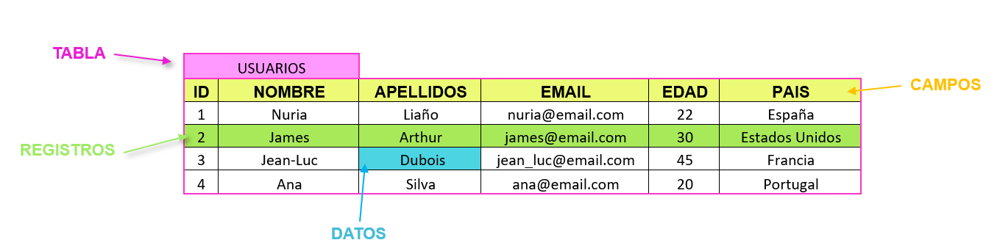

# Tablas

Una tabla es una estructura de datos que se utiliza para almacenar información en filas y columnas. Cada fila representa una entrada individual en la tabla, mientras que cada columna representa un atributo específico de esa entrada. Las tablas son la base de la mayoría de las bases de datos relacionales, lo que significa que se establecen relaciones entre ellas a través de claves y referencias cruzadas.

## Partes de una tabla

- **Tablas**: las tablas son como hojas de papel donde se escribe la información. Cada tabla tiene un nombre y varias columnas donde se escriben los datos.
- **Campos**: cada columna de una tabla se llama campo. Los campos pueden tener diferentes tipos de datos como texto, números o fechas.
- **Registros**: cada fila de una tabla se llama registro. Cada registro contiene la información de un elemento o persona en particular.
- **Claves**: las claves son como etiquetas especiales que se usan para identificar cada registro. Cada registro tiene una clave única que lo diferencia de los demás registros.
- **Relaciones**: las relaciones son como líneas que unen las tablas entre sí. Las relaciones se usan para conectar la información que está en diferentes tablas.

## Aspectos importantes y recomendaciones

### Nombre de la tabla

Nombrar una tabla en una base de datos puede parecer una tarea simple, pero es importante seguir algunas recomendaciones para garantizar que el nombre de la tabla sea fácilmente comprensible y coherente con la estructura de la base de datos. 

- **Nombres descriptivos**
- **Sustantivos singulares**
- **Evitar abreviaciones y siglas**
- **camelCase o snake_case**
- **Evitar palabras reservadas y caracteres especiales**
- **No utilizar números**

>:pencil: **NOTA**
> - **camelCase**: la primera letra de cada palabra se escribe en mayúscula y las palabras se escriben juntas sin espacios.
> - **snake_case**: las palabras se separan con un guión bajo.

### Definir la estructura de la tabla

Es importante definir correctamente la estructura de la tabla, incluyendo el nombre de la tabla, el nombre y el tipo de datos de cada columna, y las restricciones y relaciones necesarias.

### Establecer las claves primarias y foráneas

Es importante definir claves primarias para asegurar que cada fila en la tabla tenga una identificación única. Además, también es importante establecer claves secundarias para establecer relaciones entre tablas.

### Especificar las restrucciones de integridad

Es recomendable establecer restricciones de integridad en la tabla para garantizar que los datos ingresados cumplan con los requisitos y no violen las reglas establecidas. Por ejemplo, las restricciones de integridad pueden garantizar que no se ingresen valores nulos o que se cumplan ciertos límites de longitud o de rango.

### Optimizar el rendimiento

Es importante optimizar el rendimiento de las tablas mediante la elección adecuada de tipos de datos y la normalización de la estructura de la tabla para evitar la redundancia de datos.

### Realizar copias de seguridad y pruebas

Es importante realizar copias de seguridad periódicas de las tablas para proteger los datos en caso de fallas del sistema. Además, se recomienda realizar pruebas exhaustivas de las tablas antes de su implementación para garantizar que funcionen correctamente.

## Pasos para la creación de una tabla

## Ejemplo

~~~sql
CREATE TABLE clientes (
    id INT PRIMARY KEY,
    nombre VARCHAR(50),
    apellido VARCHAR(50),
    email VARCHAR(100) UNIQUE,
    fecha_nacimiento DATE
);
~~~

En este ejemplo, hemos definido el nombre de la tabla como "clientes". Además, hemos especificado las columnas "id" (que es la clave primaria de la tabla), "nombre", "apellido", "email" y "fecha_nacimiento", cada una con su respectivo tipo de dato.
También hemos establecido algunas restricciones: la columna "id" es la clave primaria de la tabla y, por lo tanto, no puede tener valores duplicados; la columna "email" tiene la restricción UNIQUE para asegurarnos de que cada email sea único en la tabla.