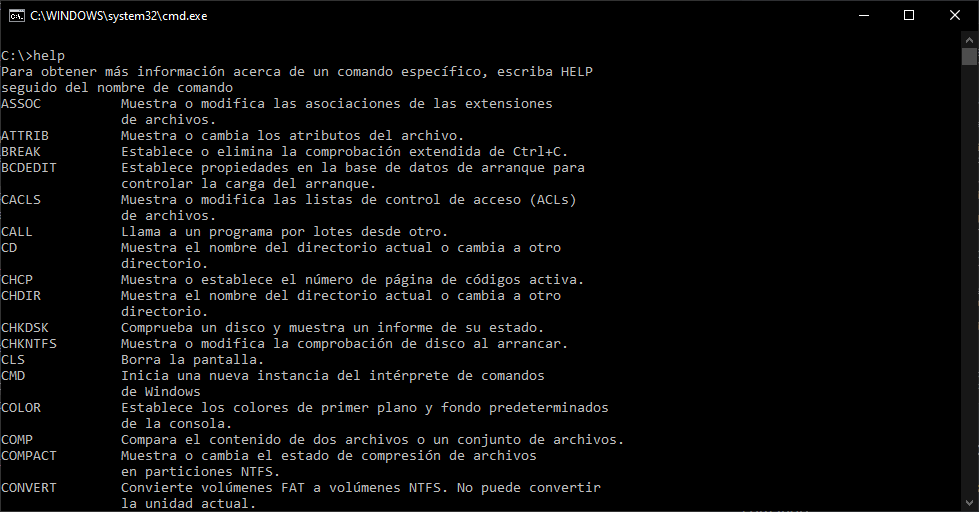

# Inicio | tutorial

## ¿Qué es el CMD?

El CMD (Command Prompt) es una interfaz de línea de comandos que permite interactuar con el sistema operativo Windows a través de comandos de texto. Permite realizar tareas como navegar por el sistema de archivos, ejecutar programas y scripts, y configurar configuraciones del sistema.

## Diferencias entre powershell y CMD

PowerShell es una herramienta de automatización de tareas y administración del sistema de Windows que también utiliza una interfaz de línea de comandos. PowerShell es más avanzado que CMD en cuanto a funcionalidad, ya que permite trabajar con objetos y manipular datos de una manera más programática y poderosa. Además, PowerShell es más orientado a la administración de sistemas, lo que lo hace más adecuado para administradores de sistemas y desarrolladores que necesitan automatizar tareas complejas.

## Abrir consola CMD en Windows 10

La consola puede abrirse de varias formas.

### La opción más común

Presionar las teclas **"Windows + R"** para abrir el "Ejecutar", y luego **escribir "cmd"** y presionar "Enter".

### Otras opciones

- Buscar "Command Prompt" en el menú de inicio de Windows y seleccionarlo.
- Presionar las teclas "Windows + X" y seleccionar "Command Prompt" o "Command Prompt (Admin)" en el menú que aparece.
- Buscar "cmd" en la barra de búsqueda de Windows y seleccionar "Command Prompt".
- Navegar a la carpeta donde se encuentra el archivo "cmd.exe" y hacer doble clic en él para abrir el Command Prompt.

## Comandos básicos en CMD

>:pencil:**NOTA** recomiendo echar un vistazo a [ss64](https://ss64.com/nt/). Es una página web donde encontrarás una lista muy completa con información detallada de cada comando.

### Ayuda

Muestra una lista de comandos disponibles y proporciona información sobre cómo usarlos.

~~~cmd
help
~~~

### Acceder al manual de un comando

El manual del comando nos muestra información sobre el uso y los parámetros disponibles para cada comando

~~~cmd
comando /?
~~~

### Abortar ejecución de un comando

Muestra una lista de comandos disponibles y proporciona información sobre cómo usarlos.

~~~cmd
help
~~~

